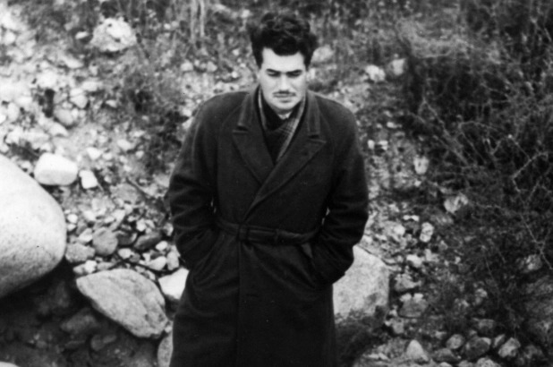

The Invisible Ships of NASA

By Geri Roberts

I height don Quixote, I live on peyote,
marijuana, morphine and cocaine.
I never know sadness, but only a madness
that burns at the heart and the brain.
I see each charwoman, ecstatic, inhuman,
angelic, demonic, divine.
Each wagon a dragon, each beer mug a flagon
that brims with ambrosial wine.

On July 20, 1969 my family gathered with our neighbors in front of the TV to watch the first man land on the moon. The
picture was fuzzy and the figure shadowy but it didn't matter. We were all silent with awe. When Armstrong's foot
touched the moon's surface and he intoned those memorable words, everybody sighed with relief. I remember being totally
enthralled. There were tears in my eyes as I thought of the wonderful things to come:  Colonies on the moon and then
people would travel to Mars and the rest of the solar system. I loved science fiction like Star Trek and I firmly
believed it was all going to come true.

Then I thought of something.  "How did they get a camera up there? How can we be watching this?"  I asked.

My father said that they had mounted a camera on the lander aimed at the ladder that Armstrong climbed down.

My father had attended a one room school house and never graduated from high school. But he was nobody's fool. He was a
licensed electrician who ran his own business during the Great Depression and supported all of his family and my
mother's family. During the war he had been a flight mechanic on a bomber in the Pacific and he worked for years in
instrumentation engineering at an oil refinery. But he never stopped to think about the explanation he gave me. He
believed it totally. So did I. And so did EVERYBODY.

Looking back over the years, I want to both laugh and cry over how the hell intelligent humans could have believed so
fervently that the Apollo astronauts actually went to the moon. And still believe it even when the very idea is exposed
as ridiculous. They even become angry.

But you didn't have to be a scientist for your own God-given common sense to tell you the whole thing was physically
impossible. From the tinfoil tiny space ship without bathrooms or insulation to the Playtex girdle material space suits
and lethal radiation everywhere that would have fried the astronauts along with their cameras and film. The list of
absurdities went on and on. What had happened to our minds?

I finally accepted the reality of the moon landings, or rather, the unreality, about four years ago. It was very
painful. I laid on my bed in a deep blue funk for a whole day. clutching the book Dark Moon: NASA and the
Whistler-Blowers. How could this massive trickery have been played on everyone? As I read, I found myself picking the
lies out from where they had embedded themselves in my mind like fat ticks. It was as if I had been under a spell...

That was it!  It went against everything I had been taught about both science and religion and was utterly irrational,
but I knew that some sort of magic spell had been cast over all of us. You could call it mind control, but that simple
term lacks the dark grandeur of the word "Magic."  .

My concept of magic was changed by that revelation.. Children are told that magic doesn't exist and then they turn into
adults who can be controlled by it because they won't believe in it even when it does bad things to them. Whoever or
whatever is running Planet Earth believes in magic and is using it to control us. And it is Black Magick because magic
used on a person without their knowledge or consent is malevolent magick.. Period.

I began to learn about magick. It's not hard. Information is all over the place, as if the Nefarious Elite are proud of
it. They probably are. In fact, they WANT us to know about it. Why is that? Because we cannot underestimate our
amusement value to these people, or whatever they are. They enjoy rubbing our faces in the unspeakable things they do
with our hard earned tax dollars.

We cannot escape the fact that NASA was created by second rate Nazi scientists (the Russians grabbed the first rate
ones) and Black Magicians, the most infamous of which was a man named Jack Parsons.. People associated with NASA
describe him as a genius even as they play down the sex magic rituals, beastiality, pedophilia, incest and all the other
loathsome practices of the Aleister Crowley founded Ordo Templi Orientis of which Parsons was an enthusiastic and
contributing member. The FBI later called all this a "love-cult". Because of his membership in the Agape Lodge in
California, Parsons was officially expelled from the scientific companies Jet Propulsion Laboratory and Aerojet which he
had founded but, strangely, he is still regarded with awe and affection by them..

Parson's best buddy was a conman/Naval Intelligence officer/science fiction writer named L. Ron Hubbard. The two of them
conducted magical workings and summonings in 1947 and many people seriously believe they conjured up some kind of evil
spirit. This is very possible because the CIA was born in that year. All these frantic rituals and calling to spirits
may remind you of the antics of John Dee and HIS pet conman Edward Kelley back in 1582 who kicked off the British Empire
that is still making the world miserable.

Parsons was such a genius that Hubbard managed to run off with his wife, his yacht and his money. And it took a while
for this rocket scientist to figure that out..

This brilliant scientist actually had a laboratory in his home in Pasadena where he would play with dangerous
explosives. Parsons won the 1952 Darwin Award for removing himself from the gene pool when he blew himself up with a
batch of fulminate of mercury. But, to be fair, it was very possible he was murdered. Especially since his mother was
probably "suicided" soon after.

This is the genesis of NASA. So why do we trust anything they say? We simply hand over billions of dollars and exclaim
over the puppet shows they perform for us..

And why do we find it difficult to believe they have murdered people? In 1967 Gus Grissom, Ed White and Roger Chaffee
were burned to death under very suspicious circumstances during a pre-launch test; circumstances so suspicious that even
Grissom's family claim he was murdered after he began to draw the public's attention to serious problems with the space
craft.

Grissom was a decorated war veteran and test pilot with degrees in mechanical engineering and aeromechanics. But after
his death he was portrayed in the 1983 movie The Right Stuff as an ignorant clown who lost his spacecraft after he
panicked during a splash down. The movie even made fun of his wife. We never thought to ask why the character of a dead
man was so thoroughly and unfairly trashed. More Black Magic, and we just sat there in the theater and laughed.

A man named Thomas Baron was a quality control inspector for North American Aviation, the company responsible for the
construction of the Apollo spacecraft. In 1967, six days after he made a report critical of NASA's safety precautions,
and was preparing a more intensive report, he and his family were killed when a train hit their car. Just a coincidence.

The Black Magicians of this world only have power over us because we give it to them. Yet I honestly cannot blame anyone
for wanting to keep their eyes shut to what the Apollo program really was or what really happened in Dallas in 1963 and
in New York and the Pentagon on 9/11. I'd love to go back to being a 15-year-old who believed in Mr. Spock and Captain
Kirk and the coming of the Space Brothers. But I can't.

I do believe that each and every human has to open his own eyes and learn to see through the illusion into what this
place really is. Until we do that, in this lifetime or another, we are trapped here without even knowing we're trapped.

There is something called the Myth of the Invisible Ships. It says that when indigenous peoples in the Americas first
saw a sailing ship of the Conquistadores, they literally could not see it. It was so out of their world view, their
normal every day vibrational frequency, that it was invisible to them until their shaman performed a ritual that allowed
them to see. This story might be "just" a myth, but myths contain enormous truth. Maybe that enormous truth is that we
perceive only a fraction of the frequencies surrounding us and until we are able to expand our perception we are at the
mercy of anyone who knows how to manipulate those frequencies, and us..

 
