<meta name="title" content="The Biblical Jesus Christ is a combination of the new Lord - our Sun, and the human Andronicus Christ" />
<meta name="description" content="The Biblical Jesus Christ is a combination of an Astrological Allegory for the new Lord - our Sun combined with the story of human Andronicus Christ of the Crimea" />
<meta property="og:image" content="/christ/christ_is_the_sun7.jpg" />

## [Solar Mythology and the Jesus Story](https://solarmythology.com/lessons/christ2002.htm)

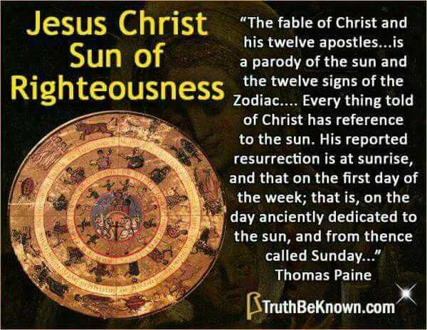
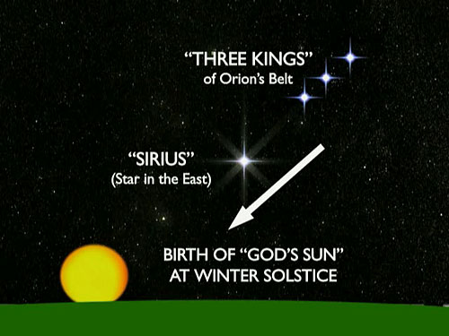

The Biblical Jesus Christ is a combination of an Astrological Allegory for the new Lord - our Sun combined with the
story of human Andronicus Christ of the Crimea

**Comparative Religion** — The basic plot of the Jesus Story, including the motif of a crucified savior, already existed
in many other religions long prior to the alleged time of Jesus. This also has been thoroughly covered elsewhere by
other people (click [here](../cr.htm) for more information).
**Solar Mythology** — The Jesus Story is actually an _allegory_ for what would naturally [be one of] the oldest and most
important story humans would notice and write down, that of the annual passage of the seasons of the year. The position
of the Sun against the celestial sphere changes during the year. This is explained below. (For a more thorough
explanation see [Lessons on Solar Mythology](../index.htm#solarmyth))

## Ancient People Looked At The Stars

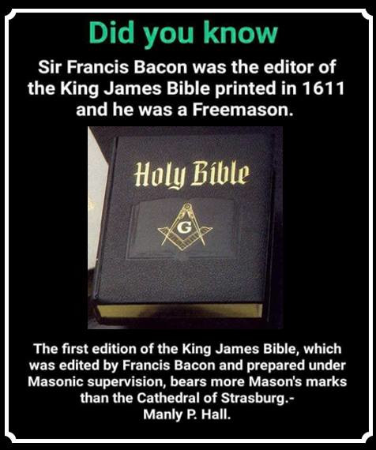

In ancient times people were very familiar with the Sun and the stars. At night, they had nothing better to do than gaze
up at the stars. They didn't conquer darkness with the flip of a light switch like we do nowadays. When sunset came that
was it—that was the end of the day. They observed how the stars move across the sky during the night, and how different
constellations are visible at different times of the year.

They made up stories which were allegories based on what they saw. Later on, these stories took on a life of their own,
as the stories were passed down from generation to generation but the knowledge of what the stories represented was
lost. People started believing the stories were real and actual history of events that actually really happened in the
past, when originally the stories were nothing more than allegories for what people saw happening in the stars.

It's not surprising in our present culture of digital watches and wall calendars that we've lost the original
astronomical meaning of these Bible stories. Today most people never look at the stars or pay any attention to the
position of the sun in the sky.

## Our Story Takes Place In Heaven

“_For our conversation is in heaven; from whence also we look for the Saviour, the Lord Jesus Christ._
” [Philippians 3:20](http://www.biblegateway.com/bible?passage=Philippians+3:20&version=KJV)

Heaven has always been up. Hell has always been down. Heaven and Hell are not just theologically opposite, they are _
geometrically_ opposite. Heaven above; Hell below.

Go outside at night and look up. You are literally looking at heaven. And what do you see? You see all the stars, which
make up all the constellations. The Jesus Story takes place not on earth, but in the starry night sky above.

And that is the solution to the conundrum. That is the secret to understanding the Jesus story. The entire story of
Jesus’ travels during his one-year ministry is an _allegory_ for the yearly journey of the Sun through the twelve zodiac
constellations and the passage of the seasons of the year.

I will now explain how this is so.

## Sunset—Best Time To Observe The Stars

Just after sunset is a good time to note the position of the Sun relative to the stars. The stars become visible just
after sunset. You know the Sun is just below the horizon, so you can get a good idea of where the Sun is relative to the
celestial sphere of stars.

At right, we see the Sun begins in Capricorn on December 22\. (All dates are for “Biblical Times”, around the first or
second century AD, when the Jesus Story was written. In our present age you have to wait until January 18 to see what
they saw on December 22, due to the earth’s precession. See [Lesson on Earth's Precession](precession.htm)). Note how
each day at sunset Capricorn gets lower and lower until it is completely below the horizon. The Sun appears to travel
upwards along the ecliptic through Capricorn towards Aquarius. Aquarius is where the Jesus Story begins. In
January/February the Sun travels through Aquarius, the water bearer, because it's the rainy season—and in the Jesus
Story we have Jesus visiting John the Baptist, who baptizes with water.  
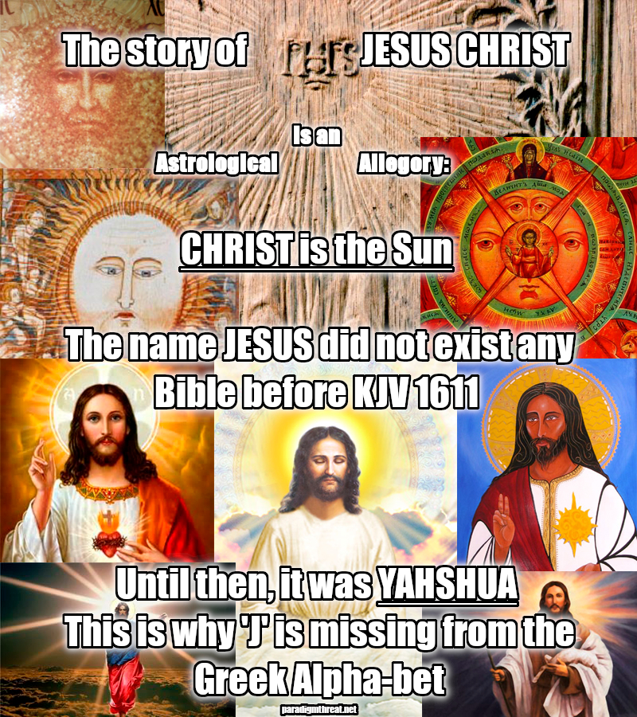

## The Jesus Story Begins With John The Baptist (Aquarius)

January Sunset. The Sun is just below the horizon. The Sun is in Aquarius, currently halfway below the horizon. Pisces,
the two fish, are above. As the month progresses Aquarius will appear lower and lower at sunset, until it is completely
below the horizon, and Pisces will be on the horizon.

In mid-January the Sun enters Aquarius. The constellation Aquarius is visible at sunset on the western horizon where the
sun sets. Aquarius is the bringer of water, because it's the rainy season. Rain is the first step in the harvest cycle.
When the Sun sets in the west, there is Aquarius just above the western horizon.

Actually Aquarius doesn't look anything like a man holding a pitcher of water. The constellation has more to do with
what time of year it is and the significance of what is happening at that time of year. The rest is just an imaginative
connecting of the dots to draw a picture of what you've already decided should be there in that part of the sky. (
See [The Constellations Don't Look Like What They're Named](constel.htm))

In January, it is traditional in church to start reading through one of the Gospels depicting the life of Jesus. The
Jesus story always begins with Jesus visiting John the Baptist, who baptizes with
water. ([Mark 1:1-13](http://www.biblegateway.com/bible?passage=Mark+1:1-13)
; [Matthew 3](http://www.biblegateway.com/bible?passage=Matthew+3)
; [Luke 3](http://www.biblegateway.com/bible?passage=Luke+3)) And that is the beginning of the allegory. Jesus is a
personification of the Sun; John the Baptist is a personification of Aquarius. Jesus [the Sun], visits John the
Baptist [Aquarius].

## February Sunset. One month later. The Sun is now in Pisces. Aquarius is now below the horizon.

As the month progresses the constellation Aquarius gets lower and lower on the western horizon and eventually ends up
entirely below the horizon in February. The constellation Pisces, which comes after Aquarius, is now on the western
horizon, and the Sun is said to now be in Pisces—the two fish. The constellation Aquarius is now below the horizon, and
won't be seen at sunset again for six months, when it pops its head up on the eastern horizon at sunset.

February is a good time to go fishing. After all, there's a lot of water around from Aquarius bringing all that rain.
Hunting isn't very good and there's no harvest yet to eat, so it's a good time to go fishing and eat fish.

Thus, after the month of Aquarius the Sun moves into Pisces, the two fish. Again the constellation really doesn't look
much like two fish, the constellation has more to do with what time of year it is and the significance of what is
happening at that time of year. The rest is just an imaginative connecting of the dots to draw a picture of what you've
already decided should be there in that part of the sky.

In the Jesus story after Jesus [the Sun], visits John the Baptist [Aquarius] the Bible says, “After John was put in
prison, Jesus went into Galilee,....” ([Mark 1:14](http://www.biblegateway.com/bible?passage=Mark+1:14)
; [Matthew 4:12](http://www.biblegateway.com/bible?passage=Matthew+4:12)
; [Luke 3:20](http://www.biblegateway.com/bible?passage=Luke+3:20)
; [John 3:24](http://www.biblegateway.com/bible?passage=John+3:24)). Suddenly John the Baptist is "put in prison", and
Jesus just goes on his merry way! There is no further explanation in the Bible, which seems quite strange if John were a
real person. We want to know why he was "put in prison." What crime was he accused of? Who threw him in prison? Was
there a trial? Did Jesus attend the trial and speak on his behalf? No. Nothing more is said. Jesus just continues on his
journey and appears unconcerned about John the Baptist.

This is all very strange and hard to understand if interpreted as a story of real life events, but it all makes perfect
sense when understood as an astronomical allegory. John the Baptist being put in prison is merely an allegory for the
constellation Aquarius at sunset moving lower and lower until it is below the horizon at the end of the month and can no
longer be seen. It is a natural phenomenon that requires no further explanation, and that is why there is no further
explanation in the Bible.

Jesus, the Sun, continues on his way into "Galilee". The word "Galilee" literally means "circuit". The original Greek
word is γαλιλαις {gal-il-ah'-yah} (Strong's
Greek [#1056](https://www.blueletterbible.org/lang/lexicon/lexicon.cfm?Strongs=G1056&t=KJV).
Click [here](https://www.blueletterbible.org/kjv/mar/1/14/s_958014) to see the verse in Greek), which is a word of
Hebrew origin לילג {gaw-lee-law'} (Strong's
Hebrew [#01551](https://www.blueletterbible.org/lang/lexicon/lexicon.cfm?Strongs=H01551&t=KJV)). A "circuit" is a
closed, usually circular path. The ecliptic is the circuit the Sun travels along during the year. The ecliptic is a
great circle inscribed on the celestial sphere. The ecliptic is also a circle on a planisphere. Jesus, a personification
of the Sun, continues on his way along the ecliptic, or "Galilee".

So in February the Sun moves into Pisces, the two fish, and in the Jesus Story, Jesus leaves John the Baptist,
apparently unconcerned about his fate, and visits Simon and his brother Andrew, who are two fishermen. Simon and Andrew
are personifications of the two fish of Pisces. ([Mark 1:16](http://www.biblegateway.com/bible?passage=Mark+1:16)
; [Matthew 4:18](http://www.biblegateway.com/bible?passage=Matthew+4:18)
; [Luke 6:14](http://www.biblegateway.com/bible?passage=Luke+6:14)
; [John 1:41](http://www.biblegateway.com/bible?passage=John+1:41)) During this season faithful Catholics,
Episcopalians, and Mahommedans observe Lent, when they abstain from meat and live upon the fishes. Christians also use
the fish as a symbol of their religion.

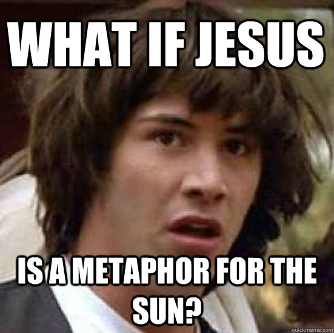
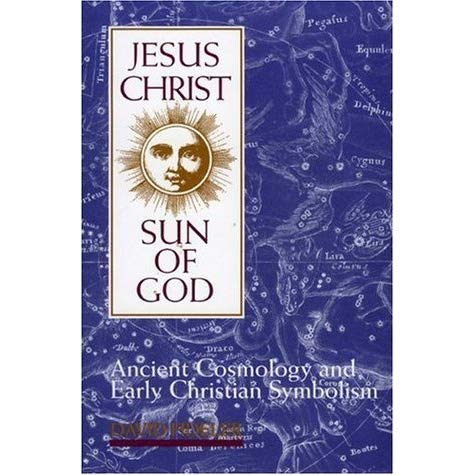

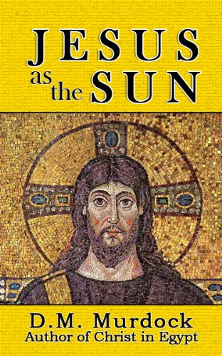
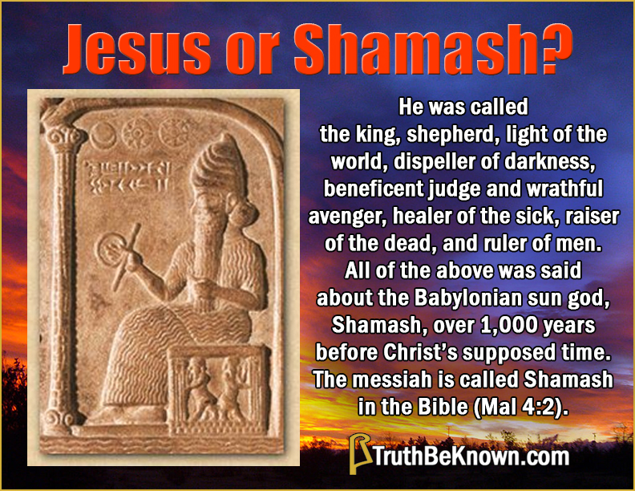

## Aries, the lamb of March, follows Pisces.

In March some wonderful things happen. Baby animals are born in March. Baby lambs are born. And the Sun moves from
Pisces into the constellation Aries — the Ram, or Lamb. Jesus is sometimes referred to as "the Lamb of God".

Again I'll mention if you actually look at these constellations in the starry night sky they don't look anything like
what the astronomers tell you they do. Aquarius doesn't look anything like a man holding a pitcher of water; Pisces
doesn't look anything like a couple of fish; Aries doesn't look anything like a Ram or Lamb. These constellations have
more to do with what time of year it is and the significance of what is happening at that time of year. The rest is just
an imaginative connecting of the dots to draw a picture of what you've already decided should be there in that part of
the sky.

In March the days get longer and warmer, the Sun goes higher in the sky, and the crops begin to grow. The Sun, which had
been rising south of due east, rises farther north each morning, until it reaches the point when the Sun rises directly
due east. This day is the Vernal Equinox. 'Vernal' means spring. 'Equinox' is two words — 'equi' means equal, 'nox'
means night. Because on this day, the Vernal Equinox, the day and night are of equal length.

At this time Christians celebrate Easter. East-er, because the Sun is rising due east. Easter is defined as the first
Sunday after the first full moon after the Vernal Equinox, when the Sun rises directly in the east. Thus, Easter day is
technically defined to be:

1. Wait for the Vernal Equinox, the day when the Sun rises directly in the east, hence East-er.
2. Wait for a full moon, because they didn't have electric streetlights at night and if you want to have a party it's
   much nicer to have it during a full moon. The full moon is your night streetlamp.
3. Wait for Sunday, our religious day of the week set aside for religious parties.

And voilà, we have the secret behind the scheduling of Easter.

It's customary for Christians to get up early on Easter morning to watch the Sun rise, then go to church and announce,
“He has risen, He has risen indeed!”

Jews celebrate Passover at this time. Pass-over, because the Sun is passing over the due east mark.

## Taurus, the bull of April. After Taurus is the Milky Way.

After the Milky Way is Gemini, the twins Castor and Pollux.

In April the Sun passes through Taurus. Then in May the Sun passes across the Milky Way — that starry band that lies
like a lake across the night sky. At this point in the Jesus story Jesus crosses "the lake" and we have the allegorical
story of Jesus calming the storm (which may be cited as a symbolic representation of the weather becoming milder and
more temperate around the Pisces part of the year)
. ([Mark 4:35-41](http://www.biblegateway.com/bible?passage=Mark+4:35-41)
; [Matthew 8:23-27](http://www.biblegateway.com/bible?passage=Matthew+8:23-27)
; [Luke 8:22-25](http://www.biblegateway.com/bible?passage=Luke+8:22-25)
; [John 6:16-24](http://www.biblegateway.com/bible?passage=John+6:16-24) [1](#f1))

After the Sun crosses the Milky Way it moves into the constellation Gemini—the twins Castor and Pollux. The two bright
stars in Gemini are named Castor and Pollux. In the Jesus story, after crossing the lake (the Milky Way), Jesus heals
two demon possessed men (I bet their names were Castor and
Pollux) [(Matthew 8:28-34)](http://www.biblegateway.com/bible?passage=Matthew+8:28-34) Castor and Pollux are also
explicitly mentioned in [Acts 28:11](http://www.biblegateway.com/bible?passage=Acts+28:11) — "After three months we put
out to sea in a ship that had wintered on the island. It was an Alexandrian ship with the figurehead of the twin gods **
Castor and Pollux**."

The allegorical Jesus story continues to parallel the passage of the seasons of the year. I'll quickly skim through it.

## Cancer, the crab that goes backwards—June. Followed by Leo, the Lion of Summer—July.

In June the Sun passes through Cancer — the Crab that thought to go backwards (June 21 - July 22). The starting date is
June 21, the Summer Solstice, the longest day of the year, when the Sun is at its highest ascension. After this day the
Sun does go backwards, beginning its descent southward, as the days get shorter and shorter.

In July the Sun passes through Leo the Lion (July 23 - Aug. 22), for the strong hot days of summer.

Around this point in the Jesus story an interesting thing happens — John the Baptist reappears and is beheaded.
According to the Bible, “John the Baptist has been raised from the
dead,” ([Mark 6:14](http://www.biblegateway.com/bible?passage=Mark+6:14)), or “This is John the Baptist; he has risen
from the dead!” ([Matthew 14:2](http://www.biblegateway.com/bible?passage=Matthew+14:2)). Recall at the beginning of the
allegory how Aquarius moved below the western horizon at sunset as the year went from January to February and the Sun
traveled from Aquarius to Pisces. Each Zodiac constellation in turn goes below the horizon at sunset as each month
passes. After six months the constellation of Aquarius begins to rise on the eastern horizon at sunset, and it appears
that the head of Aquarius is cut off by the horizon. This is John the Baptist rising from the dead, the dead being those
who are below the earth. This is the beheading of John the Baptist by King Herod, a personification of darkness, which
reigns supreme at night (See [Matthew Chapter 2—The Birth of Jesus](mat2.htm) for more on King Herod).

Afterward comes the story of Jesus'
transfiguration ([Mark 9:2-13](http://www.biblegateway.com/bible?passage=Mark+9:2-13)
; [Matthew 17:1-13](http://www.biblegateway.com/bible?passage=Matthew+17:1-13)
; [Luke 9:28-36](http://www.biblegateway.com/bible?passage=Luke+9:28-36)). Jesus goes to a high mountain top and shines
very brightly, just as the Sun is high in the sky and shines warmly and brightly during these Summer months. (For more
on the Transfiguration see [commentary by Bishop John Shelby Spong](../biblenotes/transfiguration.htm).)

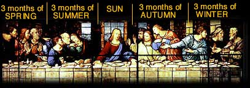

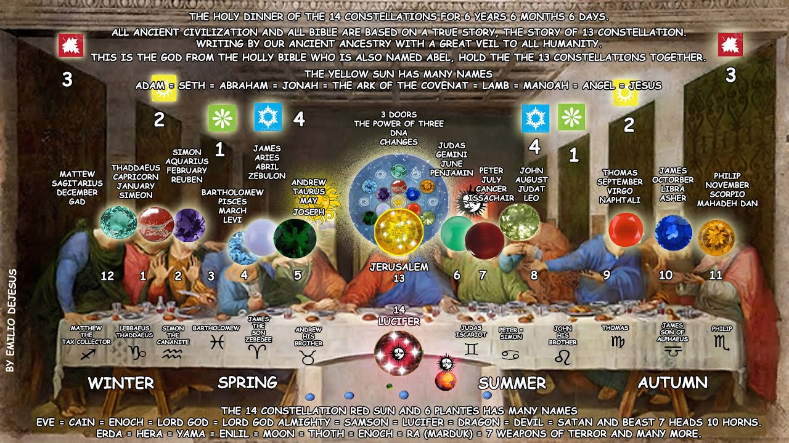
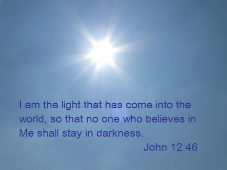

## After Leo comes Virgo the virgin of the harvest season.

Summer passes, the story of Jesus’ journeys continues. We eventually come to the end of Summer, the month of August, and
it's harvest time! Harvest time is the best time of the year, the time we’ve all been waiting for. In August the Sun has
moved out of Leo, the strong lion of summer, and into a new constellation that represents the harvest, that food which
grows out of the virgin soil of the earth. Hence, the constellation for harvest time is a female virgin holding a sheaf
of wheat. The constellation the Sun enters in August is Virgo, the eternal celestial virgin, holding a sheaf of wheat
representing harvest time. Farmers who till the fields are said to be wedded to this celestial virgin for which they
wait for each year. Thus, they are known as "husbandmen," and their tools such as tractors are known as implements of
husbandry.

Harvest time comes about three quarters of the way through the year, and it’s the happiest time of the year. And about
three quarters of the way through the Jesus story is his triumphant entry into Jerusalem, which is the happiest part of
the story ([Mark 11:1-11](http://www.biblegateway.com/bible?passage=Mark+11:1-11)
; [Matthew 21:1-11](http://www.biblegateway.com/bible?passage=Matthew+21:1-11)
; [Luke 19:28-44](http://www.biblegateway.com/bible?passage=Luke+19:28-44)
; [John 12:12-16](http://www.biblegateway.com/bible?passage=John+12:12-16)) Everyone knows him and is happy to see him.
Jesus’ triumphant entry into Jerusalem is an allegory for the Sun’s triumphant entry into Virgo, because that means it’s
harvest time, the best time of year. Harvest time is "The Kingdom of Heaven" time which Jesus refers to in earnest as
coming soon throughout the story up to here.

## Libra, the “Scales of Justice”

After the harvest the Sun moves from Virgo into Libra, the Scales. (September). These are the "Scales of Justice." The
harvest has been gathered, it is now time to sell the harvest. Scales are used in buying and selling the harvest. At the
end of harvest time, when there is nothing left to sell, the money changers pack up and leave. The Bible says, “Jesus
entered the temple area and drove out all who were buying and selling there. He overturned the tables of the money
changers.” ([Mark 11:12-19](http://www.biblegateway.com/bible?passage=Mark+11:12-19)
; [Matthew 21:12](http://www.biblegateway.com/bible?passage=Matthew+21:12)) Jesus, the Sun, representing the passage of
time, moves out of Libra, the Scales of Justice, and the money changers pack up and leave, because the season has passed,
and they are finished selling the harvest.

As we enter the season of Autumn the leaves fall from the trees and the trees appear to wither. It is at this point in
the story that Jesus is said to curse the fig tree and make it wither, a story which makes no sense if Jesus were a real
person, but it makes perfect sense when understood as an allegory. It is simply Autumn, and Jesus, the Sun, who makes
the seasons pass, causes the leaves to fall from the
trees ([Mark 11:20-25](http://www.biblegateway.com/bible?passage=Mark+11:20-25)
; [Matthew 21:18-22](http://www.biblegateway.com/bible?passage=Matthew+21:18-22))

In the Jesus story we then have the **Last Supper**, where Jesus and his twelve disciples, a reference to the twelve
zodiac months of the year, recline and eat the
harvest. ([Mark 14:12-26](http://www.biblegateway.com/bible?passage=Mark+14:12-26)
; [Matthew 26:17-30](http://www.biblegateway.com/bible?passage=Matthew+26:17-30)
; [Luke 22:7-38](http://www.biblegateway.com/bible?passage=Luke+22:7-38)) This is the natural time of year to have a
huge feast. In America, we celebrate Thanksgiving and have a huge feast of food. We eat the flesh of the
fruit—figuratively the flesh of Jesus, who personifies the Sun which make the fruit grow; and we drink wine—the blood of
the grapes, figuratively the blood of Jesus, who personifies the Sun which made the grapes grow. Without this food we
would perish.

## In Autumn the Sun travels through Libra, Scorpio, and Sagittarius.

The Jesus story goes tragically downhill from there, just like in the season of Autumn the year tragically winds down
and comes to an end as the days become short and cold. In October the Sun enters Scorpio, the Scorpion, which
figuratively stings the Sun to make it slowly die. The days begin to get shorter and colder as the Sun rises lower and
lower each day.

In the Jesus story Jesus is betrayed by Judas, one of the twelve zodiac months of the year. Judas represents Scorpio,
the month of October. Judas betrays Jesus for 30 pieces of silver, representing the 30 days of the month. The month
being one cycle of the phases of the moon. The moon, a piece of silver in the sky.

Jesus is handed over to Herod — a personification of Night. Herod, or the darkness of Night, is taking over Jesus, the
Sun, as the days get shorter and shorter in Autumn and darkness begins to reign. (
See [Matthew Chapter 2—The Birth of Jesus](mat2.htm) for more on King Herod).

Jesus is handed over to Pontius
Pilate. [Click [here](http://www.blueletterbible.org//kjv/luk/3/1/s_976001) to see the verse in Greek]. "Pontius",
ποντιος {pon'-tee-os} (Strong's
Greek [#4194](http://www.blueletterbible.org//lang/lexicon/lexicon.cfm?Strongs=G4194&t=KJV)), is literally "of the sea",
a reference to the sea of stars above. (It's also of Latin origin, betraying it's late addition to the text.) "Pilate",
πειλατος {pil-at'-os} (Strong's
Greek [#4091](https://www.blueletterbible.org//lang/lexicon/lexicon.cfm?Strongs=G4091&t=KJV)), is literally "armed with
a spear", a reference to Sagittarius, the archer, the man armed with a spear. Pontius Pilate is a personification of
Sagittarius, the last constellation the Sun passes through during the last month of the year, Nov. 22 - Dec. 21\. Pilate
is the last person Jesus sees in the story — Sagittarius is the last zodiac month of the year. Sagittarius is a man on a
horse with a bow and arrow. He is the man armed with a spear. It is a good time of the year to go hunting. The animals
are full-grown. But the days get shorter and shorter and colder and colder as the year comes to a close. Things look
dark and gloomy. What will happen to our savior, the Sun, who makes the harvest grow? Will he disappear forever?

Jesus is crucified and placed in a cave. It is the end of the story. A sad ending. But have faith. Jesus, the Sun, will
arise again — a new year will begin. Three days after Jesus is placed in the cave he will arise again. This is the
prophecy.

On Christmas day, December 25, we celebrate the birth of Jesus. December 22 was the Winter Solstice, the shortest day of
the year, when the Sun was at its lowest. Three days later, on December 25, the sun rises 1/10 of its width farther
north — just barely detectable by carefully observing the shadows cast at sunrise. Our savior, the Sun, has been reborn,
to begin the cycle of the year and the cycle of life again.

Originally Jesus was said to have been born in a cave.
The [Catholic Encyclopedia (1910) article on "Bethlehem"](http://www.newadvent.org/cathen/02533a.htm) says, “The
tradition of the birth in a cave was widely accepted, as we see from Origen's words about a century later: — In
Bethlehem the cave is pointed out where He was born, and the manger in the cave where He was wrapped in swaddling
clothes, and the rumor is in those places and among foreigners of the Faith that indeed Jesus was born in this cave —. (
Contra Celsum, I, li.) It is reproduced also in the apocryphal gospels (Pseudo-Matt., xiii, ap. Bonaccorsi, op. cit.,
159-163; Protevang. of James, xvii sqq., Bonaccorsi, 155-159; Gospel of the Infancy, II-IV, Bonaccorsi, 163-164)
.” [See Eusebius's [Life of Constantine](http://www.newadvent.org/fathers/25023.htm), lib. 3, chs xl, xli, and xlii.] [Also see [Matthew Chapter 2—The Birth of Jesus](mat2.htm)]

Hence, the story is circular, just as the years are circular. A new year begins after the old year ends.

On New Years Eve we personify Father Time and Baby New Year, but we know these two figures aren't real people, they are
merely personifications of the passage of time and the beginning of a new year. The current year is old and finished
with. A new year is about to begin. The moment the Old Year ends a New Year begins. The cycle of life is circular and
never ending.

In the Gospel story of Jesus, after his resurrection the story ends. People have always asked what did he do after that?
Why does the story end here? Why isn't the rest of his life chronicled? — The reason is, if you want to read the
continuation of the story, turn back to page one. The story is circular. Three days after Jesus dies and is placed in
the cave he is born again, and the story begins anew.

In church, it is customary to begin reading through one of the Gospels at the beginning of the year. Each Sunday we take
the next chunk of the story and read it and the pastor makes a sermon on it, never realizing that the story is an
allegory for the passage of time, the seasons of the year, which we ourselves live and experience, as we live our lives,
dependent on the Sun for light and for food.

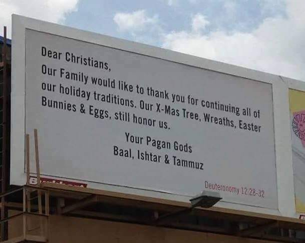

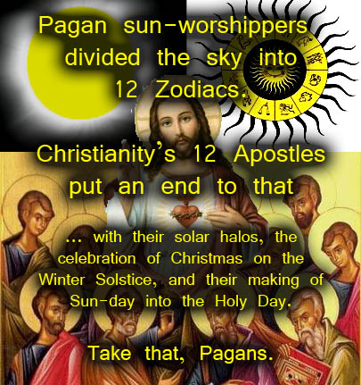

## THE CHRISTIAN CROSS

The cross Jesus is crucified on represents the division of the four seasons of the year: Winter, Spring, Summer, Autumn.
The four posts of the Cross divide the year into the four seasons. The circle you often see in the center of the Cross,
the symbol of Christianity, represents the ecliptic, the circular path of the Sun. A planisphere is a map of the starry
night sky. A planisphere also doubles as a time of year calendar. On the planisphere along with the stars is drawn the
ecliptic — the apparent path the Sun takes through the stars during the year. On the planisphere the ecliptic is close
to a circle. You can divide the planisphere into the four seasons of the year by drawing a cross on it. Thus, you end up
with a cross with a circle in the middle. The Cross on top of Goleta Presbyterian Church has the traditional circle in
the middle of it.

The whole Bible is mostly astrological allegories. The reason the book of Revelation doesn't make any sense is because
it's an astrological allegory. It makes sense when you start to interpret it in that
manner. [See [The Book of Revelation](../biblenotes/revelation.htm)]. The Old Testament also originated as an
astrological allegory.
The story of Adam and Eve is the story of Virgo and Boötes, the constellation next to Virgo. The whole story of Moses is
an astrological allegory. There is no evidence that any of it actually happened, and quite a lot of evidence that it
didn't. So is the story of Joseph and his coat of many colors, the youngest and most favorite of twelve brothers. The
number 12 again is a tip off that this is an astrological allegory of the 12 months of the year and the 12 signs of the
Zodiac.

Not only that, solar mythology goes beyond the Bible and can be shown to be the basis of most of our  most
cherished folk tales and fables. Little Red Riding Hood, Jack and the Bean Stalk, Cinderella, Homer's Odyssey (Odysseus
is the Sun who takes a long journey, yearning to return to his wife, Penelope, who represents Virgo. Odysseus then
shoots an arrow through twelve axes, representing the twelve months of the year; a feat only the Sun can do) — they all
trace their roots back to solar mythology as astrological allegories. They are creative personifications of natural
phenomenon. (For more information see the rare book [_Fairy Tales: Their Origin and Meaning_](../bookr.htm#FAIRYTALES)
by John Thackray Bunce, 1878.)

It's not surprising in our present culture of digital watches and wall calendars that we've lost the original
astronomical meaning of these stories. Today most people never look at the stars or pay any attention to the position of
the Sun in the sky. There's a lot of answers to be found in this area of research, and hardly anyone is looking in
this direction.

## CONCLUSION

I will close on a positive note that all of this study of the Jesus story which has led to a study of the Seasons of the
Year can actually lead us towards a more spiritual understanding of life. A Jewish scholar, Arthur I. Waskow, in 1985
concluded his book [Seasons of our Joy](http://www.amazon.com/exec/obidos/ASIN/0807036110/daviddeleysho-20) about the
Jewish holidays of the year, saying:

“In a world in which any moments of rest, celebration, meditation — the festivals of any religious tradition or
spiritual orientation — are often seen as "a waste of time" because they detract from productive work, it is crucial to
remind ourselves that work is not the only valuable behavior. Doing, making producing, must be part of a rhythm in which
being also has its place. This is the ultimate message of the Seasons of our Joy: that there is joy in the seasons
themselves, in our very decision to join in noting them, in celebrating them, in walking the spiritual path — the spiral
— that they make.”

—(January 2003)

For a much more thorough explanation of Solar Mythology and how it parallels the Jesus story, see

[LESSONS ON SOLAR MYTHOLOGY AND THE JESUS STORY](../index.htm#solarmyth)

