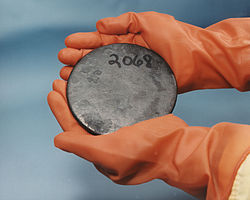
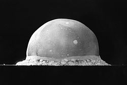
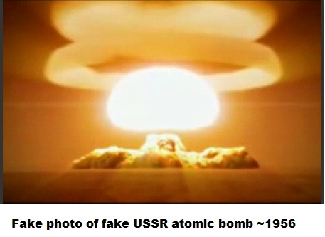
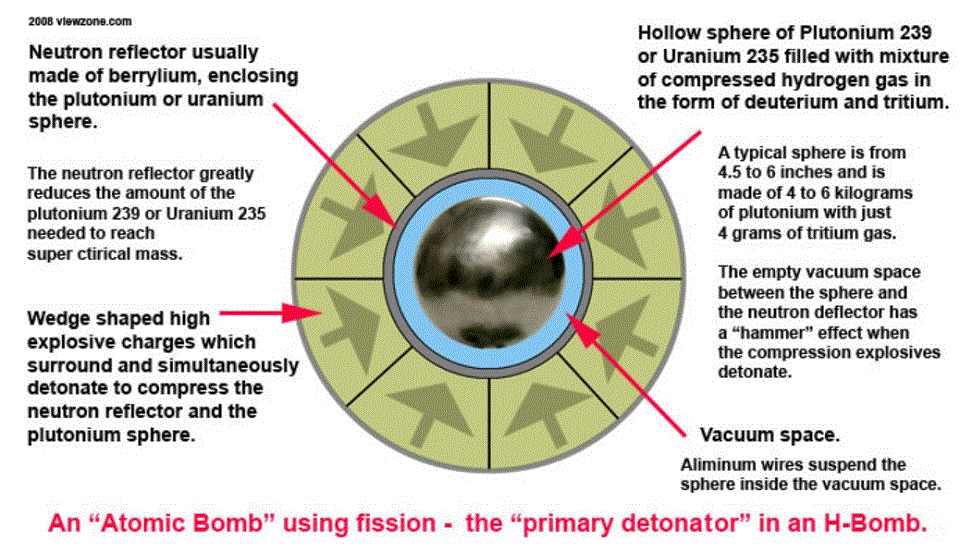
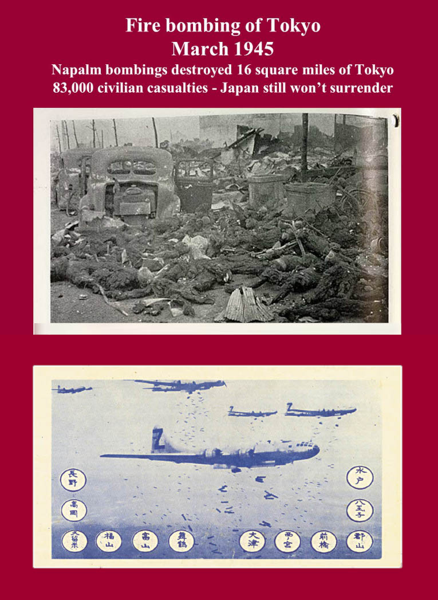
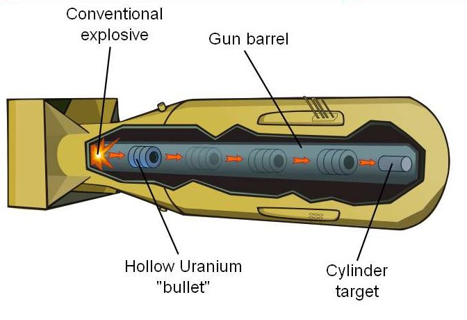

## [The Nuclear Scam by Galen Winsor (1986)](https://www.youtube.com/watch?v=IVoKztKs6-E)

```
Note: This investigation is a work in progress. Check back soon for more updates!
```

Ben Williams Presents: The Nuclear Scare Scam by GALEN WINSOR (1986)

Galen Winsor is a nuclear physicist of renown who worked at, and helped design, nuclear power plants in Hanford, WA; Oak
Ridge, TN; Morris, IL, San Jose, CA; Wilmington, NJ. Among his positions of expertise he was in charge of measuring and
controlling the nuclear fuel inventory and storage.

Galen Winsor has traveled and lectured all over America, spoken on national talk radio, and made several videos exposing
the misunderstood issues of nuclear radiation. He shows that fear of radiation has been exaggerated to scare people … so
a few powerful people can maintain total control of the world’s most valuable power resource. Filmed by Ben Williams in

1986.

In the video, you can watch Galen lick a pile of highly radioactive uranium off the palm of his hand and ignite a chunk
of plutonium into a shower of flaming dust. The guy also drank reactor cooling pool water for fun and liked to go
swimming in the pool to relax.

He also spiked the basement flooring of his own home with enough radioactive material to send any Geiger counter reading
off the scale to disprove the fear mongering surrounding radon at the time.

Galen surmises the regulations and fear mongering that surround radioactive materials are in place to prevent the
widespread adoption of nuclear power in local small scale neighborhood/home based reactors. Galen also points out that
hot nuclear “waste” can be effectively turned into a safe power source through thermionic conversion, which is how the
U.S. submarine navigation network was powered. The heat it gives off can also be used to safely heat homes.

He points out that nuclear “waste” is worth roughly $10 million (in 1986 dollars) a ton if it were to be reprocessed to
collect its useful
isotopes, so all of this talk about trying to bury it is a sham. He says the power companies are holding all the waste
with the intent of playing the plutonium futures market. The “waste” could be stored above ground in already constructed
buildings meeting all the regulatory requirements without the need to have these outrageous basalt mines dug into
mountains. The only reason he can think of for these underground vaults is to hide bodies/evidence that the state
doesn’t want uncovered.

At its core, he says federal controls over nuclear material is about maintaining power and control over the masses
through the denial of self-sufficient power sources. Obviously if one had a personal sized power source that was cheap
and efficient, they wouldn’t need to be connected to the “grid” for anything. The power grid is the control grid our
rulers use to keep us under their thumbs.

He also says Three Mile Island was an intentionally created disaster, and that a core meltdown could not melt its way
deep into the Earth. We see shades of 911 and Fukushima here…. Could Chernobyl be the same? The answer is frightening.

## [Explanations why a-bombs and h-bombs do not work](http://www.members.tripod.com/heiwaco/bomb1.htm)

## My Atomic Bomb Findings The grand manipulation 1945-2020

by Anders Björkman, M.Sc.

Have you heard about Trofim [Lyssenko](http://fr.wikipedia.org/wiki/Trofim_Denissovitch_Lyssenko)? He was the
inventor of
[pseudoscience](http://en.wikipedia.org/wiki/Pseudoscience)
or really bad, fake science around 1930! Stalin loved him. Ever heard about Stalin? He was in charge of the
Socialist/Communist Paradise (sic) in the Sovietunion 1924 - 1953\. A very competent mass murderer that together with
Hitler, an incompetent madman, started WW2 by attacking east Poland and Finland 1939 and the Baltic states 1940 and who
US president Roosevelt liked a lot. Stalin could keep east Poland, a part of Finland and the Baltic states after
[WW2](http://www.members.tripod.com/heiwaco/vk12.htm). Ever heard about US president Roosevelt, FDR? He was quite
competent and created the _fake_ [atomic bomb](http://www.members.tripod.com/heiwaco/bomb.htm) under great, military
secrecy 1942/5! With a plenty help from friends. FDR had 1942 asked his secretary of war and destruction, Henry Lewis
Stimson, to secretly build nuclear weapons. FDR died April 1945 and was replaced by Harry Truman. And in July Stimson
could inform Truman that two a-bombs were ready to be dropped on Japan August 1945, where the war was still on. USA had
just lost plenty soldiers - >100 000 killed and injured - invading small islands like Iwo Jima February and Okinawa
little later.

Atomic bombs were and are however just propaganda lies and bad science. There is no evidence that they worked in war
1945 or in peace later. The atomic bombs were invented by an American Robert O Lyssenko - a cousin of Trofim - but
assisted by A. Einstein and encouraged by Roosevelt and Stalin!

No atomic bombs ever exploded over Hiroshima and Nagasaki August 1945\. News about 100.000's of Japanese being _
vaporized_ in nanoseconds FLASHes and disappearing in thin air or slowly being killed by nuclear _radiation_ during
several months afterwards autumn 1945 at various Japanese hospitals were just Fake News and propaganda!

No scientific reports until July 1945 exists that atomic bombs were ever developed anywhere.

No legal and medical records in Japan can confirm that 100 000's of Japanese either disappeared 6-9 August 1945 due to
atomic bomb attacks or the following months due to radioactive _radiation_. Only stupid atomic bomb museums full of lies
suggest it. And of course annual memorial ceremonies in Japan.

Remember, the bigger the LIE, the least evidence is required for it. And all Japanese will just smile and agree. To
avoid trouble, of course.

USA is 2020 the greatest military force on Earth with shiny uniforms, medals, graveyards, salutes, 100.000's KIAs, MIAs,
etc. And it has lost most wars since 1945 because it doesn't use atomic bombs in Korea, Vietnam, Afghanistan, Iraq,
Libya, etc. Do you know why?

No atomic bombs have ever exploded on planet Earth! Nuclear weapons are just bullshit to keep the world afraid! And big
business. And bad science.

Roosevelt died 1945 with the secret. He was only 63\. Ten years younger than me 2020, who is still young and beautiful (
see photo top right) to tell you the Truth many years on. It upsets plenty bad scientists. It is the whole idea! I know
that we all are told from young age that atomic bombs work, but I cannot understand that all of you believe it today

2020.

[Air power](https://www.commondreams.org/views/2019/06/04/american-cult-bombing-and-endless-war?utm_campaign=shareaholic&utm_medium=referral&utm_source=facebook&fbclid=IwAR2gbe_vafR98r-75A2R43y1k_OSdWeMmwHG6OjK9JL0-oIXnOGBF7AVGq4)
is enormously expensive. Air power often lengthens wars rather than shortening them. Pounding peasants from two miles up
is not exactly an ideal way to occupy the moral high ground in war.

There are plenty old and recent descriptions of the falsifications of the 1945 A-Bombs.

Dr. Michael Palmer, MD, has just written a book about it:

["We breathed the GASES when the Atom BOMB Fell - The evidence that the nuclear bombings were faked with napalm and
mustard gas"](https://archive.org/details/Hiroshima_revisited/)

Palmer shows how US authorities faked the _medical_ records in Japan to support the 1945 manipulations. Palmer
thinks that working nuclear weapons were only made years later. I think nuclear weapons are 100% pure propaganda!

Another example is ['The Smyth Report'](https://www.orau.org/ptp/pdf/smythreport.pdf), the official US government
history of the Manhattan Project to make an A-Bomb from scratch issued in 1945\. It is all propaganda fantasies!
No A-Bomb was ever built!

Then there are
the ['Five Myths About Nuclear Weapons'](https://books.google.com/books/about/Five_Myths_About_Nuclear_Weapons.html?id=70ZRhKAHM4oC&printsec=frontcover&source=kp_read_button)
by Ward Wilson
and ['Racing the Enemy'](https://books.google.com/books/about/Racing_the_Enemy.html?id=iPju1MrqgU4C&printsec=frontcover&source=kp_read_button)
by Tsuyoshi Hasegawa about the A-Bombs that never were built nor used. Ward Wilson didn't like Hasegawa - ['
The Bomb Didn't Beat Japan...Stalin Did'](https://foreignpolicy.com/2013/05/30/the-bomb-didnt-beat-japan-stalin-did/).
Then you can
read ['Five Days in August'](https://books.google.com/books/about/Five_Days_in_August.html?id=LoQgCgAAQBAJ&printsec=frontcover&source=kp_read_button)
by [Michael D. Gordin](https://vimeo.com/109149783). All these stories are just stupid copy/paste of the 1945 US
*A-Bomb* propaganda!

My article below is only about false/invented Atomic/A-Bombs, lying atomic bomb witnesses and unsafe nuclear power
plants, bla, bla, and is in many parts for easy reference. Enjoy them. Just click around! It is free and fun. It has
taken me >20 years to compile them.

Summary

1. _This article explains the good news that atomic bombs are just_ _propaganda_ _and do not work._

2. _Any info to the opposite is US_ _lies_ _and_ _propaganda_ _since_ _1945__._

3. _The_ _>75_ _years old bullshit from_ _6 August 1945_ _about military_ _explosive_ _fission is of
   course still working kept going strong by several governments, crazy armed forces and plenty physicists incl. Nobel
   prize winners that cannot get any better jobs than lying for their governments - the only real job many physicists
   can
   get apart from being low paid school teachers - and by mainstream_ _media_ _that are experts in publishing fake
   info._

4._10 000's_ _of atomic bombs have since_ _1946_ _been built, transported around, mishandled, dropped by
mistake but none has ever exploded._

5. _Reason is that an atomic bomb cannot explode._ _It is physically impossible. Military_ _explosive_ _
   fission is_ _pseudoscience__!_

6. _Nuclear arms are therefore very safe and secure! They cannot harm anything._

7. _The_ _Islamic Republic of Iran_ _is trying since 30 years to construct a fake atomic bomb that_ _
   Stalin_ _did in four years 1945/9 ago assisted by Gulag prisoners and_ _Wismut AG_ _of Aue, Saxony._

8. _The International Atomic Energy Agency, IAEA, and its boss_ _Yukiya Amano_ _and the emperor_ _Kim III_ _
   of North Korea are part of the bullshit. Just ask them about it. They are paid to lie about atomic bombs. Just laugh
   at
   them and refer them to this web site._

9\. _The only good thing_ _Adolf Hitler_ _did not do1938 was to build his own atomic bomb. It seems he didn't
believe all those Germans that told him that atomic bombs worked and easily wiped out all opposition._

Content:

3.1 An atomic bomb does not work (Iran and [ISIS](#Iran), please, take note!)

[3.2](#32) Anyone, incl. Iran, can build a 4 400 kg heavy atomic bomb ... but it does not work

[3.3](#33) The Björkman atomic bomb - total weight 80 kg

[3.4](#34) But you need Uranium-235 ... and it is a little complicated

[3.5](#CC) Compress mechanically metal Uranium-235 and suddenly it ignites

[3.6](#36) Uranium-235 ignites if it has a [critical mass](http://en.wikipedia.org/wiki/Critical_mass)

[3.7](#37) But only 0.1% of a Uranium-235 atomic becomes energy in an atomic bomb

[3.8](#38) ... only 1.5% of the Uranium-235 critical mass exploded or fissioned in an atomic bomb

[3.9](#39) Fission fizzle

[3.10](#310) Only fools believe that metal in mechanical contact with metal ignites

[3.11](#311) Psychological shock

[3.12](#312) Japan is a nice country ... and no atomic bombs exploded there

[3.13](#313) Atomic bomb testing ... by underpaid, summer working, stupid American and British students

[3.14](#314) No scientific evidence that an atomic device can explode = good news!

[3.15](#315) Only risk is overheating and melting of the metal and surroundings

[3.16](#316) An exponential chain reaction is not possible - Congratulations Iran, sorry or be happy Israel

[4.1](#41) Recommended videos

[5.1](#Iran)[Iran could make the atomic bomb within 10 months:
experts](http://www.france24.com/en/20121009-iran-could-make-bomb-within-10-months-experts):

[6.1](#61) Addendum 1

[6.2](#62) Addendum 2

[6.3](#63) Addendum 3

[6.4](#64) Addendum 4

[7.1](#71) Why this web page?

3.1 An atomic bomb does not work (Iran and [ISIS](#Iran), please, take note!)

Nuclear[_fission_](https://en.wikipedia.org/wiki/Nuclear_fission) was discovered 1938 in Germany. It occurs, when an
atom A (e.g. Uranium 235) absorbs a free neutron _n_ under _controlled_ conditions in a laboratory,so atom A
splits into two smaller atoms B and C that fly apart and releases two free neutrons _n_, _energy/heat_ E
and _radiation_ R as per formula:

A + _n_ = B + C + 2_n_ + E + R ... (1)

The [_strong forces_](https://aether.lbl.gov/elements/stellar/strong/strong.html) keeping the protons and neutrons
of atom A together disappear in no time producing E and R, while the two new, free neutrons _n_ have
problems finding other atoms A to continue _fission_. If a free neutron _n_ is not absorbed by another atom
A, it dies after ten minutes or becomes a proton and an electron and a meson. The free neutrons _n_ may produce
more fission, but only due to _moderation (slowing down!)_ inside a peaceful nuclear power plant/reactor (or a
laboratory). This _fission_ has been studied in laboratories for years and is described in peer reviewed papers.

A[_fission bomb_](https://en.wikipedia.org/wiki/Nuclear_fission#Fission_bombs) on the other hand, otherwise known as
a _nuclear_ bomb or a-bomb, is a _fission_ _reactor_ designed to liberate as much _energy_ E as rapidly as possible
to kill people, _before_ the released energy causes the _reactor_ and content to melt (sic) and the chain reaction to
stop (sic), we are told. This _explosive, military fission reactor bomb_ was _secretly_ invented 1945 by criminal
pseudo-scientists/terrorists in the USA without any peer review or similar.

It kills people, we are told, because the two (or three), free neutrons _n_ immediately, in no time, are absorbed by two
or three other atoms A as per (1) producing four or six more atom splits, + more free neutrons _n_, etc, etc,
producing billions of atom A splits and new atoms B and C flying around during a nano-second releasing plenty _
energy/heat_ E and _radiation_ R = an atomic bomb _explosion__,_ _FLASH_, _radiation_, mushroom
cloud killing civilians ... before it melts!

This _- killing people - military, nuclear physics_ is totally phoney, which I explain further down. There is no
evidence that it works and exists. It cannot be and has never been tested in a laboratory of course. But to become a _
nuclear expert PhD_, you must agree that an _explosive, military fission reactor bomb_is a real fact!

If you ask Google _How does an atomic bomb work?_, you will get 11,700,000 results in 0.49 seconds but not find this
website giving the answer. Reason seems to be that Google has been ordered to confuse matters promoting US
Departments of Defence and Energy and their absurd nonsense. There are also plenty bad _'nuclear physicists'_ and _'
nuclear scientists'_ that say that it is easy for humans to build and use atomic bombs, so that they later can employ
themselves at DoD or DoE to lie about and invent things about nuclear weapons of massdestruction.

[Wikipedia](http://en.wikipedia.org/wiki/Nuclear_fission#Fission_bombs) cannot really explain how a nuclear atomic
bomb works, unless you believe that _a very nasty, military type of__explosive__fission_ _producing_ _
destruction__, invented by an_ _American_ _clown under military secrecy_ _1942/5_ _exists:_

_Until_ _destruction_ _is desired, the bomb is kept_ [_
subcritical_](https://en.wikipedia.org/wiki/Critical_mass) _- in the case of a uranium bomb, it is achieved by keeping
the fuel in a number of separate pieces, each below the_ _critical_ _size or mass. No fission occurs!_ _To produce
destruction__, the pieces of uranium are brought together rapidly into compressed contact with each other - to become
a_ _critical__mass_ _with a_ _free neutron_ _in between - which drives the instantaneous_ _explosive
fission_ FLASH _of the nuclear weapon_ _into the atmosphere. It lasts some nano-seconds and vaporizes and_ _
radiates_ _innocent people that happen to be in the way. It cannot be stopped after being started._

This nasty type of military, _explosive_ _fission_ is however pure [
pseudoscience](http://en.wikipedia.org/wiki/Pseudoscience) to scare you and a BIG JOKE explained below.

[_Nuclear
fission_
](http://www.nuclear-power.net/nuclear-power/reactor-physics/atomic-nuclear-physics/fundamental-particles/neutron/) _
is only possible under_ _moderated_ _and_ _controlled_ _conditions in a_ [_nuclear
power_](http://www.nuclear-power.net/nuclear-power/fission/) _plant to produce energy in form of electricity and heat
or for research. A_ [_nuclear reactor_](http://www.nuclear-power.net/nuclear-power-plant/nuclear-reactor/) _is a key
device of nuclear power plants, nuclear research facilities or nuclear propelled ships. Main purpose of the nuclear
reactor is to_ _initiate_ _and_ _control_ _a_ _sustained_ _nuclear fission, chain reaction._

_Fission producing sudden, military,_ _explosive_ _destruction_is pure [
pseudoscience](http://en.wikipedia.org/wiki/Pseudoscience) or really bad science to scare you and a BIG JOKE.
Evidently bringing two separate, _subcritical,_ pure, solid metal pieces of uranium or plutonium in sudden physical
contact with each other does not produce _one_ solid piece with a critical mass that suddenly detonates in
nano-seconds. _Two solid metal pieces cannot become one by compressing them together ... and even if they can, they will
not detonate. Metal cannot explode or_ _fission_ _in nano-seconds in a_FLASH !

You should wonder why Wikipedia cannot say so!

So I (left) will here explain how it doesn't work, and I will pay you €1.000.000:-, if you [prove
me wrong](chall.htm)in this and other matters.

[In the USA it is against the law to even suggest that atomic bombs do not
work](http://www.members.tripod.com/heiwaco/bomb.htm#USA), but I am living in southern France, where the sun is
shining most of the time and the wine is good.

Swedish Nobel prize winner (physic) [Manne Siegbahn](http://www.members.tripod.com/heiwaco/bomb.htm#17) was
already 1945 asked or ordered to build a (_fake_) Swedish atomic bomb, but when he agreed and replied that he
would publish the drawings and all details ... he didn't get the job! And USSR dictator Stalin built his atomic
bomb 1945-1949 with Uranium ore from [Wismut AG](http://www.members.tripod.com/heiwaco/bomb.htm#WAG) that
... didn't contain any Uranium to talk about. Knowing Manne and Wismut AG convinced me 1999 that atomic
bombs do not work. It is simply silly _propaganda_ based on _pseudoscience_ to keep you afraid.

We are told that the US made, 4 400 kg heavy, Hiroshima [atomic WMD
bomb](http://en.wikipedia.org/wiki/Little_Boy) called 'Little Boy' was designed as follows (the drawing is a silly
fakery):


It was secretly designed or invented by a small number crazy people 1943/45 that after a while believed their own
lies supported by media and military. Effective propaganda made then people believe it was and is a _real_ bomb.

It worked as follows according to[How Nuclear Bombs Work](http://science.howstuffworks.com/nuclear-bomb5.htm) by
William Harris, Craig Freudenrich, Ph.D. and John Fuller:

_The simplest way to bring the_ _subcritical_ _masses together is to make a gun that fires one mass into the other.
A sphere of_ U235 _is made around the neutron generator and a small bullet of_ U235 _is removed. The bullet is
placed at the one end of a long tube with explosives behind it, while the sphere is placed at the other end. A
barometric-pressure sensor determines the appropriate altitude for destruction and triggers the following sequence of
events:_

_1\. The explosives fire and propel the bullet down the barrel._

_2\. The bullet strikes the sphere and generator,_ _initiating_ _the_ _fission_ _reaction._

_3\. The_ _fission_ _reaction begins._

_4\. The bomb_ _ignites, explodes_ or _detonates__._

Evidently nobody has ever, since 1945 until today 2017 been able to prove in a laboratory that sudden, _mechanical
contact_ at high pressure of _two_ masses of pure metal (Uranium-235, U235) together making up _one_ _
critical mass_ in this collision will _initiate a military fission_ FLASH _reaction,_ so a _fission
reaction begins exponentially_ ... and that _a bomb ignites, explodes detonates_ ... unless it is in a top secret
scientific paper. Effective propaganda is always simple.

How can anyone believe the above nonsense?

_Ignite_ means that something catches fire, _explode_ means that something bursts or shatters violently and
noisily as a result of rapid combustion, decomposition, excessive internal pressure, or other process, typically
scattering fragments widely, and _detonate_ means that something explodes.

But you cannot compress two atoms or two pieces of solid metal by a collision.

The two pieces just bounce.

Try yourself - drop a piece of steel on another piece of steel. They do not join up to become one bigger piece! Same
with pieces of uranium. Anyway, just read on about the bullshit:

3.2 Anyone, incl. Iran, can build a 4 400 kg heavy atomic bomb ... but it does not work

So the (_fake_) US atomic bomb is not very complex or big - about 3 meters long with diameter 0.7 meter, but heavy -
mass 4 400 kg!! Anyone can build it! But it doesn't work. Full details of the _physics_ behind the 4 400 kg is
available in the top secret [Los Alamos Primer](http://library.lanl.gov/la-pubs/00349710.pdf ) by a Mr. R. (Bob)
Serber. He secretly suggested 1943 that the _energy release_ of 1 kg of [Uranium-235
metal (](http://en.wikipedia.org/wiki/Uranium-235)U235[)](http://en.wikipedia.org/wiki/Uranium-235) corresponds to
about 20 000 tons of [TNT](https://en.wikipedia.org/wiki/TNT) (dynamite) _exploding_! The _critical volume_ of
an a-bomb fuel corresponds to a mass of 200 kg! It is smaller; if the volume is surrounded by a _tamper_! Several
kinds of _damage_ will be caused by the bomb. A very large number of _neutrons is released_ in the _explosion_! The
mechanical _explosion_ _damage_ is caused by the blast or shock wave. To _initiate detonation_ the pieces of the
bomb must be brought together in less than 0.0001 seconds! The _explosion_ is then over in less than 0.000001
seconds. The pieces are brought together at a speed of 10.000 m/sec! Bla, bla, bla! I always wonder what
clown Mr. R. Serber was putting this nonsense together.

Item A is a front nose lock nut (!!) attached to a 1" (~2.54 cm) diameter main steel rod holding the 6 [
Uranium-235 metal (](http://en.wikipedia.org/wiki/Uranium-235)U235[)](http://en.wikipedia.org/wiki/Uranium-235)
target rings (item H) in place on top of a Tungsten-Carbide tamper plug (item F) and inside the 6.5" (16.5 cm)
inside diameter Tungsten-Carbide tamper cylinder sleeve (item I).

Each U235 target ring weighs ~5.08 kg, i.e. all 6 target rings weigh together ~30.5 kg.

A target ring has inside diameter ~2.54 cm (1") and outside diameter ~11.8 cm (4.65") and height ~2.57 cm (1.01")
and volume 268 cm3 and weighs ~5.08 kg, because the density of the metal U235 is about 18.95 g/cm3.

Total height of the 6 target rings is 15.4 cm (6.06").

If the front nose locknut (item A) is not secured, the target rings (item H) will drop off! And items B
, C, F, G andI will be loose.

Item S is the 9 Uranium-235 metal (U235) projectile rings.

Each projectile ring weighs ~3.39 kg and has height 1.71 cm (0.67").

The inside diameter is ~11.8 cm (4.65") and the outside diameter is ~16.5 cm (6.5") so the projectile rings can
slide inside the cylinder sleeve - item I and the 6.5" bore gun tube - item N. Total height of item S is
15.4 cm, i.e. same as item H. How the projectile rings (item S) and items T, U and W are secured inside the
cylinder sleeve/gun tube and do not drop down by themselves is not clear! Nine projectile rings weigh ~30.5 kg.

The target rings and projectile rings have combined (_critical_) mass 61 kg and volume 3 219 cm3 (a cube of
Uranium-235 with side 14.77 cm) that will _'explode'_ when pushed together. Evidently two pieces of cold Uranium metal
will not '_explode_' under any circumstances so what is supposed to happen according to the experts?

It is suggested that, at the same time the Uranium-235 rings are violently pushed together, four small
Polonium-Beryllium _'initiators'_ (item G) are also compressed and broken. The Beryllium metal pieces (melting
point 1 287C) and the radioactive Polonium metal pieces (melting point 254C) are initially separated by a Nickel
and Gold sheathing absorbing any [alpha particles](https://en.wikipedia.org/wiki/Alpha_particle) He2+ from
the Polonium. When violent _compression_ occurs the sheathing is broken, we are told, and the solid
Beryllium metal and solid Polonium metal pieces are mixed (!) producing _free neutrons_ _n_ with 15 000
000 m/s speed (!) that in turn _fission_ the compressed Uranium-235 rings = atomic bomb _explosion_. You
see, when you expose Beryllium to alpha particles each consisting of two protons and two neutrons fused together (
like a Helium nucleus), the Beryllium releases neutrons at 15 000 000 m/s speed and becomes Carbon (LOL)
, while the Polonium becomes Lead. Ever heard of alchemy? It is an influential tradition whose practitioners
have, from antiquity, claimed it to be the precursor to profound powers.

You should wonder why you have to compress anything to initiate the atomic bomb but it is a national and atomic physics
secret since 1945. Why not just remove the Nickel/Gold sheathing of the _'initiator'_ and let the alpha
particles produce the _fast or free neutrons_ that fission the Uranium-235, etc.?

And why didn't the atomic bomb just explode anytime, when hit by a _free neutron n_ flying around?

A small natural neutron background flux of _free neutrons n_ exists on Earth all the time, caused by cosmic ray muons,
and by the natural radioactivity of spontaneously fissionable elements in the Earth's crust.

According [John Coster-Mullen](http://www.newyorker.com/magazine/2008/12/15/atomic-john) who has built his own
atomic bombs the nine stacked projectile rings of Uranium-235 metal (U235) should have a total mass of
38.531.12 grams, and the six stacked target rings of Uranium-235 metal (U235), should have a total
mass of 25,616.44 grams. Together that is 64,14756 kg which is not a _critical mass_ of any kind.

The remaining mass of the bomb - 4 339 kg - is all the other lettered items seen above.

US Army designed it VERY HEAVY 1945! Why you need 4 339 kg of scrap to push 2 times 30.5 kg (or
whatever?) of Uranium-235 together is still a military secret 2017\. National security, you know! Remember Klaus
Fuchs!

Another [fake drawing](https://commons.wikimedia.org/wiki/File:Little_Boy_internal_diagram.svg)of the VERY
HEAVY 'Little Boy' is shown right. The basic principle is the same but the details differ completely. This is normal
when idiotic military hardware is used as propaganda. There is no Item A a front nose lock nut, etc.


Fake drawing of 'Little Boy'

3.3 The Björkman atomic bomb - total weight 80 kg

It would evidently be much simpler to just have a 60 kg cube about 14.8x14.8x14.8 cm of Uranium-235 with a hole
with an _'initiator'_, where you can inject a piece of 1 kg of Uranium-235 at a speed of >10.000 m/s
using a little mechanical device, so it ignites, when _critical mass_ 61 kg is suddenly reached. This mechanical
device incl. 61 kg Uranium-235 weighs say 70 kg. Put it in a bag with weight 10 kg and you have a [Björkman atomic
bomb](http://nuclearweaponarchive.org/News/DoSuitcaseNukesExist.html) (right) that only weighs 80 kg. Imagine that
a little cube of Uranium-235 can explode in a little bag! Of course one 1 kg piece must be injected at a speed
of >10.000 m/s into the other 60 kg piece.

Easier to handle than the stupid 4 400 kg monster allegedly used at Hiroshima.

Björkman atomic bomb with 61 kg of Uranium-235 inside

3.4 But you need Uranium-235 ... and it is a little complicated

[Uranium](http://en.wikipedia.org/wiki/Uranium-235) is a _metal_ and doesn't cost very much and is not rare.
About 53 000 tons of [Uranium](http://world-nuclear.org/info/uprod.html) were produced annually 2012\.

A friend of mine at [Freiberg, Saxony](https://en.wikipedia.org/wiki/Freiberg) (East Germany/DDR until 1990) worked
for [Wismut AG](https://en.wikipedia.org/wiki/Wismut_(mining_company)), 1948-1958, that produced 10.000 tons
of (false) Uranium for USSR to build atomic bombs - or so they say. Those were the times. Wismut AG was a private
company (in communist DDR!) 100% owned by the KGB (USSR secret intelligence/security agency) headed at the time by
comrade Serov. KGB knew the US atomic bomb was a fakery as KGB had spies everywhere in the USA fooling FBI for
years. So USSR produced their own communist atomic bomb! It didn't cost them a kopek. It was just proletarian
propaganda. It was never built. Only propaganda films and photos of fake Soviet atomic bombs were produced to
impress the proletariat and put fear into the Americans.




Disc of U235 made in USA! Just drill a hole and ... voilà ... a ring! Then compress it, or just drop it on the floor!?
... and BOOM!

One American, Paul Nitze, was behind the three most important reports that promoted the perception of a Soviet
threat against the United States after World War II. The first of these reports, NSC68, was instrumental in changing
the policy of the Truman Administration, which initially did not perceive the Soviets as a major threat. The second
Nitze report was the Gaither Report that, in 1957, said [the U.S. had fallen behind (!) the USSR in nuclear
weaponry](http://911blogger.com/news/2012-07-21/nexus-between-terror-propaganda-and-terrorism-bremer-and-jenkins).
Didn't Nitze know that the USSR bomb was a propaganda bullshit?

It is suggested that only Uranium-235 (U235) can _fission_ and that Uranium-235 (U235) makes up only
0.72% of normal Uranium metal and has to be separated from the remainder (mostly Uranium-238 (U238)) in special
factories which makes such enriched Uranium-235 (U235) a little more expensive. A Uranium-235 (U235)
atomic has three _neutrons_ less than a Uranium-238 (U238) atomic. To, e.g., obtain 61 kg of pure, enriched
Uranium-235 (U235) metal you need about 8 400 kg or 8.4 ton of Uranium to separate the Uranium-235 (U235)
from. How to separate Uranium-235 (U235) from Uranium-238?

Well, one way is, Iranian style since many years, that you treat the Uranium with Fluorine, F, so it becomes
a gas - UF6 - and then, in gas separators you separate the lighter U235 F6 molecules from the little (three
neutrons) heavier U238 F6 molecules! And then you remove the fluorine again and have _pure_, metal
Uranium-235 (U235). Voilà! Then you cast and machine the target rings and projectile rings of
Uranium-235 (U235) in any workshop. Uranium-235 (U235) is a metal like iron that can be shaped into
target rings and projectile rings. Imagine drilling a dia 1" hole in a target ring. Aren't you worried it will
fission by itself by a neutron passing so it IGNITESs? No - it must also be compressed! To double density! Very
important.

It is, however 2020 - 77 years later, still TOP SECRET, what US factory managed to separate U235 from 10
tons of U238 by gas separation or whatever - magnetism? - and then making it, the U235, a 72 kg metal slab
again and what workshop manufactured and drilled the U235 metal target rings and projectile ringsin 1945!
Reason apparently being that no such workshop or technology existed at that time, 1942-1945, and no rings were ever
manufactured. Of course, there was [Oak Ridge, TN](http://en.wikipedia.org/wiki/Oak_Ridge,_Tennessee), with 75 000
people but they didn't know what they were doing.

Some people say Clinton Engineer Works, 20 miles west of Knoxville, TN, produced the rings using the [calutron
electromagnetic isotope separation (EMIS) process](http://www.globalsecurity.org/wmd/intro/u-electromagnetic.htm).
Hundreds of thousands of magnetic type separators (!) driven by great amount of electricity were used by Clinton
Engineer Works to produce some hundred kilograms of U235. Reason for so many separators was the relatively low
product collection rate of the process and the long cycle time required to recover material between runs. The rings
and the separators would otherwise be nice atomic museum show pieces! But ... it was all stupid PROPAGANDA! No
U235 was ever produced and no separators existed!

Talking about atomic museums - there is [one](http://www.nuclearmuseum.org/) at Albuquerque, NM! It produces
a lot of [propaganda about US nuclear bombs](http://www.nuclearmuseum.org/online-museum/history/) and the [
nonsense done nearby 1945](http://www.nuclearmuseum.org/online-museum/history/the-manhattan-project/). It is supported
by US Congress! Imagine that - a museum full of lies supported by the US Congress. 2019! But Albuquerque is just
an ugly, boring dump in the New Mexico desert with an annual hot air balloon show + plenty PhD's living in the Rio
Grande gutter.

3.5 Compress mechanically metal Uranium-235 and suddenly it ignites

According underpaid US scientists 1945 the Uranium-235 (U235) atomic bomb above _exploded_ (!) over
Hiroshima, when the 9 projectile rings (item S) of 30.5 kg Uranium-235 (U235) were suddenly _
mechanically_ pushed over and _mechanically_ compressed into (?) the 6 target rings (item H) also of 30.5 kg
Uranium-235 (U235) by the projectile Tungsten-Carbide disk (item T) at a speed of >10.000 m/s (according #20
of the [Los Alamos Primer](http://library.lanl.gov/la-pubs/00349710.pdf )) and the projectile steel back (item
U) in turn accelerated by exploding cordite power bags (item W).

But you cannot _compress_ an atom or a piece of metal by a collision. It just bounces.

At the same time the Uranium-235 projectile/traget rings are in contact together, four Polonium-Beryllium _'
initiators'_ (item G) are also in contact. The Beryllium and the radioactive Polonium are initially separated by
sheathings of Nickel and Gold absorbing any alpha particles from the Polonium, but when sudden contact occurs,
the sheathings are broken and the solid Beryllium and solid Polonium are mixed or pressed together producing
free neutrons (!) that at 15.000.000 m/s speed (~3% of the speed of light) in turn _fission_ the
Uranium-235 projectile/traget rings = atomic bomb _explosion_. That a free neutron flying around at 15.
000.000 m/s speed didn't _explode_ the bomb earlier was good news for the bomber crew.

This took place 600 meters above ground, when the bomb itself was dropping _vertically_ at 324,7 m/s speed.

Why the 9 projectile rings did not drop by themselves by gravity is not clear. Maybe they were glued together and to
the disk glued to the steel back?

So an atomic bomb is very simple! Slide or drop or push (assisted by exploding cordite!) 9 Uranium-235 (U235)
projectile rings over 6 Uranium-235 (U235) target rings and compress them together inside a
Tungsten-Carbide tube (sleeve/disk/plug) a speed of >10.000 m/s, _compress_ at the same time some
Polonium-Beryllium _'initiators'_ and fission and ... BOOM. Children died! And do not forget to tighten item A

- the front nose locknut on the steel rod!

Above is evidently pure nonsense. Stupid, idiotic propaganda. It does not work! _Metal_ in contact with _metal_, be it
gold, silver, lead, iron, Uranium of any kind incl. Uranium-235 (U235) of any critical mass, do not fission
exponentially and _explode_ (initiated by a metallic Polonium-Beryllium mix producing free neutrons at 15
.000.000 m/s speed or 5% speed of light) even after being _mechanically_ compressed together at a
speed of >10.000 m/s ... suddenly.





The first a-(Plutonium) bomb explosion at 5.30 am, July 16, 1945, 0.016 seconds after destruction at about 20 meters
above ground. The FIREBALL(?) is about 600 feet (200 m) wide. The black specks silhouetted along the horizon are
trees in the desert. The picture, allegedly taken by a high speed, 64 fps (one frame every 0.0156 seconds), B/W film
camera at a distance 10 000 yard away, is a simple fakery! The photo is of a rising sun duly photoshopped 1945 Like
this [video](http://www.youtube.com/watch?v=MLmTwmsdfFM)!

Inside the fake FIREBALL is _pure energy_ that have heated up split and unsplit Plutonium atomics and the air
to >1.000.000C we are told. The pressure inside the _fireball_ is originally >1.000.000
bar, when it expands at great velocity in all directions ... if you believe the nonsense. The sudden flash flies by at
the speed of light!!!!

In this 1955 [film](http://www.archive.org/details/Operatio1955) you see a little (false) atomic bomb go off,
so next day place is safe to visit and have a look at the damages! All nuke bomb films are false! Russian, American,
French, etc.

What is supposed to happen to initiate fission? The projectile rings and their steel back (items T and U) -
say weight 50 kgs - accelerate down the 2 meters long gun tube (item N) in microseconds and collide with the impact
absorbing anvil (item E) with a velocity of _v_ - say _v_ = 150 m/s, which is pretty high. The air inside the gun
tube is compressed and would probably destroy the gun tube (higher speed - 10 000 m/s - will absolutely blew the tube
apart). Imagine firing a canon ball in a canon with the normally open end closed!

The total energy applied at collision impact is 562.5 kJ (25 000 kJ if speed is only 1 000 m/s at collision) and half of
it is absorbed by the impact absorbing anvil (item E) trying to push the projectile rings and its steel back (
item U) back up the tube. You know - objects also bounce, not just compress, at impacts. The remaining energy -
281.25 kJ - is supposed to radially compress mechanically the projectile rings and the target rings outwards (
total 61 kg) and adjacent items (say also 61 kg) but 2.3 kJ/kg energy will not compress metal a lot in any
direction. [Compare energy required to destroy WTC 1/2!](blgbclose.htm)

You really wonder what idiot or nuclear physicist came up with this crazy idea that two pieces of cold metal (
Uranium-235) mechanically compressed together using cordite would start to _fission_ and _explode_. Would really
the two cold metal pieces merge into one? What really happens at the contact surface between the projectile rings
and the target rings? Do the rings become one solid mass? And why would it _explode_? Free neutrons flying
around from a Polonium-Beryllium mix?

The speed of light is 299 792 458 m/s and free neutrons are said to travel at such speed. For at neutron to
travel 0.047 m outwards through projectile rings will take 0.157 nano-seconds! It will take a little longer
to travel inwards through the target rings as they are thicker. While travelling through the projectile and
target rings, the neutrons multiply by fission and temperature increases. In less than one nano-second plenty atoms
have fissioned resulting in the famous, white FLASH.

3.6 Uranium-235 ignites if it has a [_critical mass_](http://en.wikipedia.org/wiki/Critical_mass)



The blast wave and FIREBALL have apparently just hit ground stirring up some (false) dust

The _'experts'_ have an answer to that. _Critical mass_! The _critical mass_is the smallest amount of pure,
metal, _fissile_ material needed for a sustained nuclear exponential _chain reaction_ that cannot be stopped after it is
started. For Uranium-235, U235, the _critical_ mass is 61 kg! If 30.5 kg of metal U235 projectile rings
are brought in sudden mechanical, _compressive_ contact with 30.5 kg of metal U235 target rings they add up
to 61 kg = [_critical mass_](http://en.wikipedia.org/wiki/Nuclear_fission)! A 3.39 kg projectile ring in
contact with a 5.08 kg target ring does not produce explosive _fission_! Why? Because 3.39 + 5.08 = 8.47 kg is
not a _critical mass_! On the other hand a sphere or ball of Uranium-235 with diameter 17 cm has a critical
mass of only 52 kg. [Or:](http://en.wikipedia.org/wiki/Critical_mass)

_A mass may be exactly critical without being a perfect homogeneous sphere. More closely refining the shape toward a
perfect sphere will make the mass supercritical. Conversely changing the shape to a less perfect sphere will decrease
its reactivity and make it subcritical._

So a 52 kg _sphere_ of Uranium-235 is a _critical mass_ like 61 kg of _rings_ of Uranium-235. atomic
physics is just a big laugh. Military secret, of course.

In retrospect it would have been much easier to allow two 26 kg half-spheres of Uranium-235 to collide than to play
around with projectile and target rings.

And what damages are caused by cordite gases when the projectile rings or half-spheres have been pushed down the gun
tube? Doesn't the whole atomic bomb assembly blow apart? LOL! OK, OK, it was never built! It was just a joke. Any
photos of it were just photos of a mock-up! Military propaganda 1945 worth US$ 2 billion! LOL! And nuclear
physicists supported by professor [Wellerstein](http://www.members.tripod.com/heiwaco/bomb.htm#AW) believe it

2019.

3.7 But only 0.1% of a Uranium-235 atomic becomes energy in an atomic bomb

But I agree. One U235 Uranium atom may fission as discovered by Otto Hahn 1938. It works in peaceful nuclear
power and research plants. You do not have to _mechanically compress_ Uranium metal rings in a tube for it. In a
peaceful atomic power plant there is no mechanic compression of Uranium atoms or _critical masses_ of any kind
to keep the plant going.

When _one_ U235 nucleus fissions into two lighter nuclei fragments or products (i.e. other atoms), about 0.1 percent
of the mass of the Uranium nucleus appears as fission energy of 202.5 MeV ... we are told (by some [underpaid
physicist](http://en.wikipedia.org/wiki/Nuclear_fission)?):

_A. Typically ~169 MeV appears as the kinetic_ _energy_ _of the nuclei fragments (new atomics), which fly apart at
about_ _3% of the speed of light,_ _due to Coulomb repulsion._

_B. An average of 2.5 (*) neutrons are emitted, each with a kinetic_ _energy_ _of ~__2 MeV_ _(total of 4.8 MeV)
._

_C. The fission reaction also releases ~7 MeV in prompt gamma ray photons (light)._

_D. 169 + 4.8 + 7 = 180.8. Where does the remaining 2O2.5 - 180.8 = 21.7 MeV energy go? Or is there a simple addition
error?_

_Regardless, this means that a nuclear fission of_ _one_ _(!) atom emits about 3.5% of its_ _energy_ _as gamma
rays, less than 2.5% of its_ _energy_ _as fast neutrons (total ~ 6%), and the rest as_ _kinetic energy_ _of
fission fragments (this appears almost immediately when the fragments impact surrounding matter, e.g. water (?*) in an
nuclear power station, as simple heat, where_ _the reaction is controlled_ _at a certain constant temperature)._

(* Two or three neutrons are supposed to immediately fission two other U235 atoms - _chain reaction_! - but the
energy 2 MeV is much too small ... according same underpaid physicist! And evidently the fragments first impact
surrounding U235 metal ... and not water or air, i.e. the U235 metal piece is heated up first. If there is
U238 Uranium in the bomb and a free neutron collides with it, it may become radioactive plutonium 238, which is very
dangerous, we are told, etc, etc. )

Note that _no_ matter is transformed into pure energy à la Einstein here. Only one atom A is split into two other
atoms B and C - _fragments_ - and some neutrons n and gamma rays and, as they are moving, they represent kinetic
energy.

3% of the speed of light is 19 986 164 m/s and _nuclei fragments_ are said to travel at such speed. A _nuclei
fragment_ will thus travel 0.02 m during one nano-second which is about halfway through the projectile and
target rings. Maybe the _nuclei fragments_ slow down during the travel and the _kinetic energy_ becomes heat.

Therefore:

_In an atomic bomb as described above (due to_ [_exponential chain
reaction_](https://en.wikipedia.org/wiki/Nuclear_chain_reaction)_), this heat may serve to_ _raise the temperature
to 100 million K_ _(Kelvin) and cause secondary emission of soft X-rays, which convert some of this energy to
ionizing_ _radiation__._

This is utter nonsense. Nothing can react and release pure energy exponentially! High temperature will simply melt
the Uranium-235 (U235) metal assembly that will flow or evaporate away and any reaction stops at once:

_

_However in_ [_nuclear reactors_](http://www.laradioactivite.com/en/site/pages/Slow_Fast_Neutrons.htm)_, the fission
fragment_ _kinetic__energy_ _remains as low-temperature heat, which itself causes little or_ _no ionization
radiation__._

It is the speed of the neutron, when it hits the nucleus that has a lot to do with how likely a _fission_ is to occur.
One might think, intuitively, that if the neutron is going really fast that it has a better chance of “shattering” the
nucleus, but that’s not really how it works. Actually, for the fissile nuclei such U235 the SLOWER the neutron is
going, the more probable fission is.

So slowed-down neutrons to maximize fission are an absolute requirement. And then from fission comes more neutrons,
which continue the reaction. Well, mostly right. Actually, the neutrons born from fission are going really fast. Really,
really fast. And they have to slow down ~10.000 times to have a good chance of causing fission. That’s where the _
moderator_ comes in.

The _moderator_ in a _nuclear reactor_ is the material whose job it is to slow down neutrons without absorbing them.
This slowing-down is done by neutrons bouncing off the nuclei of the atomics in the moderating material. For most
reactors, moderation takes place in the _water_ that also cools the reactor.

[Great
Britain](http://www.dailymail.co.uk/news/article-455160/50-years-later-price-paid-atom-bomb.html#axzz2KEU1QHTb)
detonated its first nuclear bomb May 15, 1957 - and it looked like above ... photo by some unknown hero.

Doesn't the FLASH or FIREBALL look ... fine, fantastic, ... false? But where is the blast wave?

_For a high-temperature reactor like the liquid-fluoride reactor, graphite (carbon) is used as the moderator. This was
not really known in the1940's when the atomic bomb was said to have been invented.

It is thus the _moderated_ free neutrons that keep the _fission_ going in a peaceful nuclear power reactor by heating
the _water_. The _2 MeV_ kinetic energy of a free neutron becomes 0.01 MeV kinetic energy and the rest - 1.99
MeV - heats up the water. Fission also takes place naturally [in the Earth's
core
](http://blogs.scientificamerican.com/observations/2011/07/18/nuclear-fission-confirmed-as-source-of-more-than-half-of-earths-heat/)
and keeps it warm ... so that volcanoes can erupt and continents can move, etc. But in 1945 it was ...

3.8 ... only 1.5% of the Uranium-235 critical mass exploded or fissioned in an atomic bomb

... we are told by the 1945 atomic bomb engineers and manufacturers. Fission was made manageable 1939 and 1945
everything was known about it by clever scientists we are told ... but made top secret for _military_ and _national
security_ reasons. How convenient.

How many U235 atoms are there in a solid 61 kg atomic bomb described above? The answer is that there are about
4x1026 U235 atoms in a little, 16.5 cm diameter, 15.4 cm high, 61 kg (critical mass, LOL) U235 atomic bomb two
parts core, i.e. quite a lot of U235 atoms in the metal target ringsand projectile rings.

Only 1.5% of the 4x1026 U235 atoms, i.e. 6x1024 atoms are, according to unproven research 1944/5, supposed to
absorb one neutron and become U236 atoms that fission exponetially the other atoms during a few _nano-seconds_ to
produce an atomic bomb _pure_ energy release explosive white FLASH according some strange, unproven theory. The
military destructive, _explosive fission_ goes fast as the neutrons have speed close to the speed of light and the
nuclei fragments are only 3% slower.

98.5% of the U235 atoms do not fission exponentially as the [free
neutrons](http://www.laradioactivite.com/en/site/pages/Slow_Fast_Neutrons.htm) miss them and fly away, we are supposed
to believe. Imagine that! 98.5%. Why not 100%? So the following is supposed to happen in a U235 exponential,
military, destructive chain reaction atomic _explosion_ after two pieces of cold metal U235 are compressed together:


Fake photo of fake US atomic bomb explosion FIREBALL without blast wave

1. One metal U235 atom of total 4x1026 atoms absorbs one neutron and becomes an U236 atom that _fissions_
   and is split into two _fragments_ of some kind at high speed (3% of the speed of light) and two or three [free
   neutrons](http://www.laradioactivite.com/en/site/pages/Slow_Fast_Neutrons.htm) (also at high speed) due to
   mechanical compression. It is supposed this happen in the interface between the projectile rings and the target
   rings.

2. The two or three [free neutrons](http://www.laradioactivite.com/en/site/pages/Slow_Fast_Neutrons.htm) miss
   120-150 metal U235 atoms in the vicinity because the nuclei are very small compared to the atom itself but still
   manage to collide with 2 or 3 U235 nuclei that become U236 atoms that fission in turn and split into more _
   fragments_ and another 2 or 3 neutrons that again miss 120-150 U235 atoms in the vicinity but manage to collide with
   2 or 3 U235 nuclei, and so on until only 6x1024 U235 atoms (1.5% of total) have become 6x1024 U236 atoms
   that fissioned during a few nano-seconds chain reaction.

3. The temperature increases >1 000 000 K in nano-seconds and produces a white, hot FLASH and a [SHOCK
   WAVE](http://www.youtube.com/watch?v=paCUhiUxxIw) and the energy heats the surrounding air over several kilometres
   that produces a FIREBALL that then rises to form a dirty black (or white?) [MUSHROOM
   CLOUD](http://scribol.com/environment/8-amazing-technicolor-images-of-nuclear-fireballs).

4.The pressure increases 1 000 000 bar due to pure, white or blue, invisible energy (kinetic energy of the
fragments) being released forming a [SHOCK WAVE](http://www.youtube.com/watch?v=paCUhiUxxIw) that destroys the
surroundings (except the Bank of Japan building and similar strong buildings) and plenty noise. It also takes some
nano-seconds.

5. Then there is_nuclear radiation_ that heats up biological matter like humans killing them - _radiation
   sickness_!

6. Above only happens, if the total _mass_ of the two cold metal pieces being mechanically compressed is _
   critical_. No _moderator_ is required according to professor [
   Wellerstein](http://www.members.tripod.com/heiwaco/bomb.htm#AW) 2015 because _"you use 80-90%_ _enriched
   material_ _in a bomb",_ so _probability_ is high to hit some of the 4x1026 atomic cores and split them before they
   all melt, boil or fly away due to _fission_ of previous cores.

Regarding the fake photos of atomic bomb explosions shown above, Wellerstein thinks they are all real (in email to
me 4 February 2015):

_"Similarly I do not think you have really considered the difficulty of faking footage and photographs of nuclear
weapons. Even today, with advanced CGI, making something that looks compelling is non-trivially difficult._ _In the
1940s and 1950s it would have been impossible._ _The_ _clouds_ _in question are so much larger than those produced
by conventional explosives -- they are on the order of_ _clouds_ _produced by only immense releases of energy._ _
The radioactive effluents produced by the megaton-range destructions in the 1950s were detectable by independent
scientists all over the world._ _The size of the energy release that creates a_ _cloud_ _can be calculated roughly
in retrospect should you ever be interested -- nuclear destructions above the surface of the ground are always
characterized by an uncommonly bright_ FLASH _(a "double flash," technically), and the size of the fireball, its
rate of rise, and ultimate top altitude correlates very strongly with its energy release. That this should be true is
fairly obvious from a first-principles analysis of the movement of very hot gasses through the atmosphere. The fact of
the heavy "anvilling" of late-stage multi-megaton_ _mushroom clouds__, caused by their reaching (and sometimes
breaching) the troposphere, is evidence of their great explosive output._ _Conventional_ _explosives simply cannot
reach temperatures that would allow them to do such a thing."_

Why a dirty [MUSHROOM CLOUD](http://scribol.com/environment/8-amazing-technicolor-images-of-nuclear-fireballs) of
any type or color or a FIREBALL hanging around in the sky is supposed to develop ... except on fake footage to
impress stupid onlookers ... is not really clear. Hot air ball of fire rising?

If there are U238 nuclei mixed with the U235 nuclei, the neutron may transform the former into _plutonium*_

+ _radiation_, i.e. the U238 nuclei are not split into fragments but transformed into another substance.

_*Plutonium_ _is a fake element invented by USA in_ _1940__. It is also fissile and can be used in atomic bombs,
we are told. It is named after the planet_ _Pluto_ _discovered in the 1930's that probably doesn't exist either._

That the _nuclei fragments_ (heat) do not melt the 4x1026 nuclei solid _metal_ core is that _fission_ goes faster than
melting, we are told, etc, etc, bla, bla.

However, when the first (and only?) nucleus of 4x1026 U235 nuclei in the above bomb fissions (it is split by [free
neutrons](http://www.laradioactivite.com/en/site/pages/Slow_Fast_Neutrons.htm) from somewhere - the
Polonium-Beryllium _initiators_?), it will only heat the surrounding, as it is not cooled and the 2.5 [free
neutrons](http://www.laradioactivite.com/en/site/pages/Slow_Fast_Neutrons.htm) will just fly away and produce nothing
with their 2 MeV energy each. They cannot possibly collide with and fission anything. They must be moderated to
produce further fission like in an atomic power plant or in the Earth's core.

The 4x1026 minus 1 remaining nuclei in the little dia 16.5 cm, 15.4 cm tall chunk of U235 metal target/projectile
rings will therefore not fission further. The bomb does not work!It always fizzles! Unless the cordite blows the
whole thing apart and some innocent bystander gets a target ring or projectile ring in the face?

3.9 Fission fizzle

[Carey Sublette](http://nuclearweaponarchive.org/Library/Fission.html), self-appointed nuclear expert (!), has a
very stupid explanation of fission fizzle:

_"__Two_(sic) _conditions must be met before fission can be used to create powerful explosions:_

_1) the number of neutrons lost to fission (from non-fission producing neutron captures, or escape from the fissionable
mass) must be kept low, and_

_2) the speed with which the_ _chain reaction_ _proceeds must be very fast._

_A fission bomb is in a race with itself:_ _to successfully fission most of the material in the bomb before it blows
itself apart._ _The degree to which a bomb design succeeds in this race determines its efficiency. A poorly designed
or malfunctioning bomb may "fizzle" and release only a tiny fraction of its potential energy."_

Apparently this is a clever design:


It was never tested anywhere and exploded when dropped on Hiroshima. It didn't fizzle ... you must believe. W
exploded, S was suddenly pushed down N over H and military, destructive fission occurred ... because A
was locked tight! The [free neutrons](http://www.laradioactivite.com/en/site/pages/Slow_Fast_Neutrons.htm) made the
rest ... at the speed of light! But not in this bomb!

3.10 Only fools believe that metal in mechanical contact with metal ignites

Only fools like Mr. [R Oppenheimer](http://en.wikipedia.org/wiki/J._Robert_Oppenheimer) (a.k.a. Robert O.
Lyssenko) and badly informed people like most _politicians_ believe that Uranium-235 pure, solid metal in _
mechanical_ contact with similar Uranium-235 metal in the shape of target rings or projectile rings ... or
any metal in mechanical contact with itself - will produce ... an atomic explosion: that 4x1026 or 6x1024 metal U235
nuclei in some Uranium-235 (U235) target rings or projectile rings _fission_ exponentially in
nano-seconds into _fragments_ and release pure energy/heat and some radiation in aFLASHis just fantasy, I am happy
to inform! It was a fizzle.

Oppenheimer & Co. also invented the _plutonium-239*_ atomic bomb that was dropped on Nagasaki 9 August 1945.

_*Plutonium_ _is a fake element invented by USA in 1940\. It is also fissile and can be used in atomic bombs, we are
told._

It looked something like:



Here two _non-critical_ half spheres of pure _metal__plutonium-239_ - _total mass of which is critical_ - are
kept apart by a mysterious divider (not shown in above picture) to prevent the bomb to explode by itself in a
FLASH, if a free neutron passes by. The two metal spheres and the divider are suspended in a vacuum space by
aluminium wires (not shown in above picture). The vacuum space is surrounded by a neutron reflector enclosing the
two plutonium half spheres and the divider. Wedge shaped high explosive charges surround the plutonium half spheres.
By detonating the explosive charges, the neutron reflector, the two half spheres and the mysterious divider are _
compressed_ and the atomic bomb _ignites_. The purpose of the neutron reflector is to ensure that the neutrons
released by mechanic contact do not fly away but bounce back (!) into the _compressed_ half spheres of pure metal
plutonium-239.

What a stupid joke. Who came up with this _ridiculous_ idea? And how is that people believe these lies today?

Oppenheimer, the alleged master mind of the _fake_ Hiroshima and Nagasaki bombs, apparently thought it was all a
joke. That nobody would get killed by the massive napalm carpet bombings of Hiroshima and Nagasaki.
But [later propaganda](http://www.dailymail.co.uk/home/books/article-2237826/The-life-J-Robert-Oppenheimer-The-unstable-A-bomb-know-self-destructed.html)
suggests otherwise:

_"The day the bomb dropped,_ (Oppenheimer) _betrayed no hint of regret: Oppenheimer and his team were, in fact,
jubilant. In the vast atomic compound at Los Alamos, they had gathered to celebrate the success of the bombing mission.
Oppenheimer made a triumphant entrance on to the stage, clasping his hands together like a prize-fighter while everybody
cheered. His only regret, he said, was that they hadn’t developed the bomb in time to use it against the Germans. This
apparently ‘raised the roof’."_

_Churchill was equally gratified. ‘The whole burden of execution constitutes one of the greatest triumphs of American –
or indeed human – genius,’ he said._

Sad story. Imagine bombing 100 000's of innocent civilians in big cities and people cheer.Sounds like blind, stupid
terrorism!

3.11 Psychological shock

Better demonstrate what you know, e.g. over Tokyo Bay or Mount Fuji, where millions can watch ... and nobody
gets hurt.

But in preparation for dropping an atomic bomb on Hiroshima, [US military
leaders](http://en.wikipedia.org/wiki/Atomic_bombings_of_Hiroshima_and_Nagasaki) decided _against_ a demonstration
bomb, and _against_ a special leaflet warning, in both cases because of the uncertainty of a successful destruction, and
the wish to maximize psychological shock.

No warning was given to Hiroshima that a new and much more destructive _explosive fission_ bomb was going to be
dropped.




US terrorist napalm bombing leaflet - what would a Japanese do reading it?

 

3.12 Japan is a nice country ... and no atomic bombs exploded there

[I worked](cv.htm)May 1972 - November 1976 and lived at Yokohama on the Yamate Bluff with a great view of Tokyo
Bay to the south and Mount Fuji to the west. Two of my colleagues were children at Hiroshima and Nagasaki
1945\. They never experienced any atomic bombings. Just conventional B-29 napalm carpet terror bombings! Other
colleagues of mine worked at Korean shipyards August 1945 and left them intact and went home. Japan was occupied by USA
until 1952 and censorship and propaganda produced the ridiculous falsifications of history known as the atomic bombs (
and other things). What Japanese children really experienced 1945 was ignored and overlooked. Grown up Japanese were
just told to shut up and believe the US propaganda nonsense. When I arrived at Yokohama the central Naka-ku area between
Yamate and Yokohama stations looked as if it had been napalm saturated bombed a little earlier. But it was 27 years
ago, May 1945, three months before general MacArthur arrived and witnessed the destruction. But you could not talk
about it 27 years later.

3.13 Atomic bomb testing ... by underpaid, summer working, stupid American and British students


[San Antonio](https://en.wikipedia.org/wiki/San_Antonio,_New_Mexico) is about 28 miles from Trinity Site, where
the first nuclear bomb was detonated on July 16, 1945\. The _fireball_ looks like smoke - but let's face it. The photo
is a fakery

But wasn't an atomic bomb tested in the dark early morning at 04.00 am at [Alamogordo, NM, USA July 16,
1945](https://en.wikipedia.org/wiki/Trinity_%28nuclear_test%29)as reported by [L. R.
GROVES](https://en.wikipedia.org/wiki/Leslie_Groves), Major General, USA, and seen on [plenty
films](http://cluesforum.info/viewtopic.php?f=28&p=2393854&sid=948cd0b6f5be473d035d51299d526b11#p2393854) made?
Whatever was tested in New Mexico that morning you can read about in the ridiculous test report [
Trinity](http://library.lanl.gov/cgi-bin/getfile?00317133.pdf) written by a Mr. K. T. Bainbridge and some
assistants. It was not the bomb described above. The report is simply a _joke_ like the 18 low quality, stupid _
References_ made before and after the alleged July 16th Nuclear Explosion, by authors some of which later became physics
university professors or Nobel prize winners that could never explain how an atomic bomb actually worked (due to
national security reasons):

1\. R. W. Carlson “Confinement of an Explosion by a Steel Vessel,” Los Alamos Scientific Laboratory report LA-XXI (
September 1945).

2\. [J. H.
Manley
](http://books.google.co.uk/books?id=zAUAAAAAMBAJ&pg=PA52&lpg=PA52&dq=J.+H.+Manley+%2B+atomic+bomb&source=bl&ots=jFXTCiMqc6&sig=yAXORweGAUAoHCCgdpVP2ndAuxc&hl=en&sa=X&ei=-0hIUZmLC6ew0QXNrIHoDw&sqi=2&ved=0CDMQ6AEwAQ#v=onepage&q=J.%20H.%20Manley%20%2B%20atomic%20bomb&f=false)
“July 16th Nuclear Explosion: Micro-Barograph Pressure Measurement, ” Los Alamos Scientific Laboratory report LA-360 (
September 1945).

3\. J. L. McKibhen “July 16th Nuclear Explosion: Relating Timing, ” Los Alamos Scientific Laboratory report LA-435 (
1947).

4\. [E. W. Titterton](http://oa.anu.edu.au/obituary/titterton-sir-ernest-william-973) "July 16th Nuclear Explosion:
Fast Electronic Timing Sequence,” Los Alamos Scientific Laboratory report LA-436 (April 1946). (... he (E.W. Titterton)
gained fame as having 'pushed the button' to initiate the first atomic bomb test at Alamogordo, the consequences of his
time at Los Alamos were more profound. It made him a member of an old boys' network of virtually every leading nuclear
physicist, both experimental and theoretical, in the Western world. Most of them had lived and worked in an isolated,
close knit community for a number of years. ...).

5\. [H. A. Bethe,](http://en.wikipedia.org/wiki/Hans_Bethe) Ed., “Los Alamos Technical Series. Vol. 7 ‘Blast Wave,’
Part I (Chaps. 1-4),” Los Alamos Scientific Laboratory report LA-102O (August 1947). ( ... Bethe was sceptical of the
possibility of making a nuclear weapon from Uranium. In the late 1930s, he wrote a theoretical paper arguing against
fission, but was convinced by Teller to join the Manhattan Project. When Oppenheimer was put in charge of forming a _
secret_ weapons design laboratory, Los Alamos, he appointed Bethe Director of the Theoretical Division, a move that
irked Teller, who had coveted the job for himself. Bethe's work at Los Alamos included calculating the critical mass of
Uranium-235 and the multiplication of nuclear fission in an exploding atomic bomb....)

6\. Ernest D. Klema, “July 16th Nuclear Explosion: Fast-Neutron Measurements Using Sulfur as the Detector,” Los
Alamos Scientific Laboratory report LA-361 (October 1945).

7\. Ernest D. Klema, “July 16th Nuclear Explosion: Neutron Measurements with Gold-Foil Detectors,” Los Alamos
Scientific Laboratory report LA-362 (October 1945).

8\. R. Bellman and R. E. Marshak “Distribution Arising from a Point Source of Fast Neutrons between Two Slowing-Down
Media, ” Los Alamos Scientific Laboratory report LA-257 (April 1945). ([
Marshak](http://en.wikipedia.org/wiki/Robert_Marshak) received his PhD from Cornell University in 1939\. Along with
his thesis advisor, Hans Bethe, he discovered many of the fusion aspects involved in star formation. This helped him on
his work for the Manhattan Project, in Los Alamos, during World War II.)

9\. R. E. Marshak “JuIy 16th Nuclear Explosion: Soil Correction, Absorption of Neutrons in Soil, and Time Dependence
of Slow-Neutron Intensity. ” Los Alamos Scientific Laboratory report LA-358 (January 1946).

10.[ J. Hirschfelder](http://en.wikipedia.org/wiki/Joseph_O._Hirschfelder), R. Kamm, J. L. Magee, and N.
Sugarman "Fate of the Active Material After a Nuclear Explosion, ” Los Alamos Scientific Laboratory report LA-277 (
August 1945).

11\. [P. Aebersold](http://libraryasp.tamu.edu/Cushing/collectn/techno/aebersold/intro.html) and P. B. Moon
“JuIy 16th Nuclear Explosion: _Radiation_ Survey of Trinity Site Four Weeks After Explosion, ” Los Alamos Scientific
Laboratory report LA-359 (September 1945). (Dr. Aebersold was at t Los Alamos to assist in the health problems in
connection with the atomic bomb test. He participated in protection of personnel during the assembling and testing of
the bomb and made extensive _radiation_ measurements after the test. 24 hours after the alleged explosion, you could
visit the site without risk. During World War II [P. B. Moon](http://en.wikipedia.org/wiki/Philip_Burton_Moon

         ) was part of the MAUD Committee that confirmed the feasibility of an atomic bomb and then became part of the British delegation to the Manhattan Project, where amongst other things he did work on designing instrumentation for measuring the eventual bomb test).

12\. D. Williams and P. Yuster “July 16th Nuclear Explosion: Total _Radiation_,” Los Alamos Scientific
Laboratory report LA-353 (August 1945).

13\. J. E. Mack and F. Geiger Los Alamos Scientific Laboratory, personal communication.

14\. F. Reines and W. G. Marley “July 16th Nuclear Explosion: _Incendiary_ Effects of _Radiation_, ” Los
Alamos Scientific Laboratory report LA-364 (1945).

15\. I. Halpern and P. B. Moon, “July 16th Nuclear Explosion: Attempt to Obtain Gamma-Ray Kinephotographs, ” Los
Alamos Scientific Laboratory report LA-430 (November 1945).

16\. J. E. Mack, “July 16th Nuclear Explosion: Space-Time Relationships, ” Los Alamos Scientific Laboratory report
LA-531 (April 1946).

17\. J. E. Mack “Semi-Popular Motion Picture Record of the Trinity Explosion,’” Los Alamos Scientific Laboratory”
report LAMS-373 (April 1946).

18\. J. Blair, D. Frisch, and S. Katcoff, “Detection of Nuclear-Explosion Dust in the Atmosphere,” Los Alamos
Scientific Laboratory report LA-418 (October 1945).

Yes, the first bomb [exploded](full link: http://www.youtube.com/watch?v=XH907H1wadE) the dark night and the whole
thing was documented by a brave photographer - [Berlyn Brixner](https://en.wikipedia.org/wiki/Berlyn_Brixner)! In
the middle of the night. 04.00 am!

But there were no animals - rats, mice, pigs, dogs, chicken, etc - around to check the biological effects of the _
radiation_!

Note that there are no scientific reports of atomic bomb developments prior to July 1945!

3.14 No scientific evidence that an atomic device can explode = good news!

There is no _scientific_ evidence anywhere in above reports or anywhere by any Nobel Prize winners that an atomic
device of any kind exploded an early morning in nano-seconds in New Mexico July 16, 1945 due to mechanical, compressive
contact! The Los Alamos Scientific Laboratory was just a military camp to produce disinformation in war by underpaid
physicists and students. Who invented the above 'bomb' is not known. Some student?

Basic physics in a civilian laboratory on the other hand confirms that an atomic bomb does not work at all. [Prove me
wrong](chall.htm)and win €1 000 000:- . Reason is very simple. The free neutrons released at fission are too
fast and cannot fission another atomic. A free neutron can only fission another atomic in a peaceful atomic power
plant after being _moderated_, i.e. slowed down. You cannot moderate or slow down free neutrons in an atomic bomb.

The stupid US 3 meters long thing right never even existed except as an empty dummy on fake photos! I know there are
1.000's of web sites, e.g. [this one](http://www.cddc.vt.edu/host/atomic/trinity/tr_test.html), and [this
one](http://nuclearweaponarchive.org/), and [this
one](http://www.physicsforums.com/showpost.php?p=1762937&postcount=12), suggesting the atomic bomb works but ... they
all produce fake info and propaganda. It is a very lucrative business paid for by ignorant tax payers. And any country
can become an atomic bomb power! Just say you have the bomb. It doesn't cost much. Any [underpaid nuclear
physicist](http://en.wikipedia.org/wiki/Nuclear_fission) will agree to anything for a pay rise (as happened at Los
Alamos, New Mexico, 1945).





And the other atomic bomb powers and their _'experts'_ will not say anything. National, military security reasons, you
know! You have to be politically correct!

Today, 2015, all US atomic bombs are allegedly manufactured at the [Pantex
Plant](http://en.wikipedia.org/wiki/Pantex_Plant), at Amarillo, TX, USA, that is operated by [Consolidated Nuclear
Security](http://cns-llc.us/), LLC (CNS) company from [1 July
2014](http://cns-llc.us/wp-content/uploads/2014/07/CNS-News-Release-07012014.pdf).

It is a strange place (right) in the middle of nowhere ... where nobody but well paid guards work!

So USA is neither producing new, nor deactivating old atomic bombs that never worked in the first place? Isn't it good
news!

Luckily fission works only in peaceful, nuclear power plants and in civilian laboratories due to moderated [free
neutrons](http://www.laradioactivite.com/en/site/pages/Slow_Fast_Neutrons.htm).

Pantex Plant atomic bomb making factory at Amarillo, Texas, USA

- [Source](https://maps.google.com/maps?rct=j&q=Pantex+Plant,+Amarillo,+Texas,+%C3%89tats-Unis&url=http://heiwaco.tripod.com/fpsonew.htm&usg=AFQjCNEKzfap4Tm_NIERyiw4sutmMrdvKQ&bvm=bv.1355325884,d.bmk&um=1&hl=fr&ie=UTF-8&sa=N&tab=wl)
- where nobody seems to work.

3.15 Only risk is overheating and melting of the metal and surroundings

In a power plant the Uranium U235 is in the form of an oxide (a molecule) where the U235 part may fission and
produce heat under controlled forms. No critical masses!

No exponential chain reactions. It can never explode. Only risk is overheating of the environment due to lack of cooling
water Fukushima style.

Then the reactor enclosure will burst and its bottom may drop out (melt) and some radioactive elements will leak out.

Safety then is simply to ensure that cooling water is always available and that the bottoms of the reactors are STRONG.
Quite simple actually.

Pantex Plant atomic bomb making factory sports field at Amarillo, Texas, USA, where nobody ever runs around

You should wonder why the Pantex Plant atomic bomb factory built a sports field in the middle of nowhere (above). Maybe
because nobody has ever run there?

3.16 An exponential chain reaction is not possible - Congratulations Iran, sorry or be happy Israel

In a civilian laboratory like [SCK-CEN](http://www.sckcen.be/fr/Presse/Communiques-de-presse/SCK-PR-0201) any heavy,
radioactive, dangerous element can be bombarded by [free
neutrons](http://www.laradioactivite.com/en/site/pages/Slow_Fast_Neutrons.htm) and split into less hazardous, lighter
elements as in normal fission, but you need to apply external energy for the fission.

A Uranium-235 (U235) exponential chain reaction is not possible. The atomic bomb doesn't work. Just ask [
SCK-CEN](http://www.sckcen.be/). Congratulations, Iran! Your bomb will never work! Sorry, Israel! Your bomb doesn't
work.

[Safety at Sea](news.htm) is more complex! But there are _'experts'_ there too to produce [fake or pseudo
scientific reports](chalmers1.htm)!

4.1 Recommended videos

[How to make atomic bomb propaganda](http://www.youtube.com/watch?v=zXxIhWIdhW8)

[How to prepare the ground for an atomic bomb in
Japan](http://www.youtube.com/watch?v=GiHotElsJFw&context=C4352334ADvjVQa1PpcFN4DVQ8zXceCNCfoHEoYDDfC-zCNz0uCGk)

[NUCLEAR WEAPONS DO NOT
EXIST](http://youtube.com/watch?v=jo7Ytg9ckC0&feature=c4-overview&list=UU9y1hfjdOMBboMgC8BE70UA) The Documentary By
Edmund Matthews

Update 9 October 2012

5.1 [Iran could make the atomic bomb within 10 months:
experts](http://www.france24.com/en/20121009-iran-could-make-bomb-within-10-months-experts):

_"__Iran_ _could produce enough weapons-grade Uranium (WGU) to make an atomic bomb within two to four months and
then would need an additional eight to 10 months to build the device,_ _experts_ _said Monday_ _8 October 2012__
."_

The _'experts'_ are paid by the Institute for Science and International Security (ISIS), a non-profit,
non-partisan institution not to be mixed up with the Islamic State in Iraq and Syria, dedicated to
informing the public about science and policy issues affecting international security and the report is [IRAN'S
EVOLVING BREAKOUT
POTENTIAL](http://isis-online.org/uploads/isis-reports/documents/Irans_Evolving_Breakout_Potential.pdf)byWilliam C.
Witt, Christina Walrond, David Albright, and Houston Wood:

_"The authors use one significant quantity (SQ), defined as 25 kilograms of WGU_ (Weapon Grade Uranium)_, to represent
the amount of WGU needed for a nuclear weapon. ... Currently,_ _ISIS_ _assesses that Iran would require at least 2-4
months to produce one SQ of WGU at the Natanz Fuel Enrichment Plant and would need to utilize its stocks of 3.5 and near
20 percent LEU. The quickest estimates are 2 to 2.3 months, and they rely on an amount of near 20 percent LEU
hexafluoride that was scheduled for conversion to another form as of August 2012\. Growth in the stock of near 20
percent LEU reduces the time needed to break out, even though this stock is not currently large enough on its own to
produce one SQ."_

ISIS thinks Iran can produce an atomic bomb within 10 months and has apparently not read my article above why an
atomic bomb doesn't work. Somebody should tell Islamic Republic foreign minister Mohammad Javad Zarif about is, so
Iran could stop its nonsense about an A-Bomb.

6.1 Addendum 1

As an atomic bomb or hydrogen bomb doesn't work it is interesting to note the enormous amounts of $ money, missiles,
launch pads, war heads and persons involved to keep the US bullshit alive. If that money is or was really spent or just
another hoax, is another matter. It is a fact that no atomic bomb has ever accidentally exploded due to human
failures or mistakes when maintaining, transporting or upgrading them. Evidently you need some money/persons to keep
the bullshit going:

- Except where noted all figures are in constant 1996 dollars -

1. Cost of the Manhattan Project (through August 1945): $20,000,000,000

SOURCE: Richard G. Hewlett and Oscar E. Anderson, Jr., The New World: A History of the United States atomic Energy
Commission, Volume 1, 1939/1946 (Oak Ridge, Tennessee: U.S. AEC Technical Information centre, 1972), pp. 723-724;
Condensed AEC Annual Financial Report, FY 1953 (in Fifteenth Semiannual Report of the atomic Energy Commission, January
1954, p. 73)

2\. Total number of nuclear missiles built, 1951-present: 67,500

SOURCE: U.S. Nuclear Weapons Cost Study Project

3. Estimated construction costs for more than 1,000 ICBM launch pads and silos, and support facilities, from
   1957-1964: nearly $14,000,000,000

SOURCE: Maj. C.D. Hargreaves, U.S. Army Corps of Engineers Ballistic Missile Construction Office (CEBMCO), "Introduction
to the CEBMCO Historical Report and History of the Command Section, Pre-CEBMCO Thru December 1962," p. 8; U.S. Army
Corps of Engineers Ballistic Missile Construction Office, "U.S. Air Force ICBM Construction Program," undated chart (
circa 1965)

4\. Total number of nuclear bombers built, 1945-present: 4,680

SOURCE: U.S. Nuclear Weapons Cost Study Project

5\. Peak number of nuclear warheads and bombs in the stockpile/year: 32,193/1966

SOURCE: Natural Resources Defence Council, Nuclear Weapons Data book Project

6\. Total number and types of nuclear warheads and bombs built, 1945-1990: more than 70,000/65 types

SOURCE: U.S. Department of Energy; Natural Resources Defence Council, Nuclear Weapons Data book Project

7\. Number currently in the stockpile (2002): 10,600 (7,982 deployed, 2,700 hedge/contingency stockpile)

SOURCE: Natural Resources Defence Council, Nuclear Weapons Data book Project

8\. Number of nuclear warheads requested by the Army in 1956 and 1957: 151,000

SOURCE: History of the Custody and Deployment of Nuclear Weapons, July 1945 Through September 1977, Prepared by the
Office of the Assistant Secretary of Defence (atomic Energy), February 1978, p. 50 (formerly Top Secret)

9\. Projected operational U.S. strategic nuclear warheads and bombs after full enactment of the Strategic Offensive
Reductions Treaty in 2012: 1,700-2,200

SOURCE: U.S. Department of Defence; Natural Resources Defence Council, Nuclear Weapons Data book Project

10\. Additional strategic and non-strategic warheads not limited by the treaty that the U.S. military wants to retain
as a "hedge" against unforeseen future threats: 4,900

SOURCE: U.S. Department of Defence; Natural Resources Defence Council, Nuclear Weapons Data book Project

11\. Largest and smallest nuclear bombs ever deployed: B17/B24 (~42,000 lbs., 10-15 megatons); W54 (51 lbs., .01
kilotons, .02 kilotons-1 kiloton)

SOURCE: Natural Resources Defence Council, Nuclear Weapons Data book Project

12\. Peak number of operating domestic Uranium mines (1955): 925

SOURCE: Nineteenth Semiannual Report of the atomic Energy Commission, January 1956, p. 31

13\. Fissile material produced: 104 metric tons of plutonium and 994 metric tons of highly-enriched Uranium

SOURCE: U.S. Department of Energy

14\. Amount of plutonium still in weapons: 43 metric tons

SOURCE: Natural Resources Defence Council, Nuclear Weapons Data book Project

15\. Number of thermometers which could be filled with mercury used to produce lithium-6 at the Oak Ridge
Reservation: 11 billion

SOURCE: U.S. Department of Energy

16\. Number of dismantled plutonium "pits" stored at the Pantex Plant in Amarillo, Texas: 12,067 (as of May 6, 1999)

SOURCE: U.S. Department of Energy

17\. States with the largest number of nuclear weapons (in 1999): New Mexico (2,450), Georgia (2,000), Washington (
1,685), Nevada (1,350), and North Dakota (1,140)

SOURCE: William M. Arkin, Robert S. Norris, and Joshua Handler, Taking Stock: Worldwide Nuclear Deployments 1998 (
Washington, D.C.: Natural Resources Defence Council, March 1998)

18\. Total known land area occupied by U.S. nuclear weapons bases and facilities: 15,654 square miles

SOURCE: U.S. Nuclear Weapons Cost Study Project

19\. Total land area of the District of Columbia, Massachusetts, and New Jersey: 15,357 square miles

SOURCE: Rand McNally Road Atlas and Travel Guide, 1992

20\. Legal fees paid by the Department of Energy to fight lawsuits from workers and private citizens concerning
nuclear weapons production and testing activities, from October 1990 through March 1995: $97,000,000

SOURCE: U.S. Department of Energy

21\. Money paid by the State Department to Japan following fallout from the 1954 "Bravo" test: $15,300,000

SOURCE: Barton C. Hacker, Elements of Controversy: The atomic Energy Commission and _Radiation_ Safety in Nuclear
Weapons Testing, 1947-1974, University of California Press, 1994, p. 158

22\. Money and non-monetary compensation paid by the United States to Marshallese Islanders since 1956 to redress
damages from nuclear testing: at least $759,000,000

SOURCE: U.S. Nuclear Weapons Cost Study Project

23\. Money paid to U.S. citizens under the _Radiation_ Exposure and Compensation Act of 1990, as of January 13,
1998: approximately $225,000,000 (6,336 claims approved; 3,156 denied)

SOURCE: U.S. Department of Justice, Torts Branch, Civil Division

24\. Total cost of the Aircraft Nuclear Propulsion (ANP) program, 1946-1961: $7,000,000,000

SOURCE: "Aircraft Nuclear Propulsion Program," Report of the Joint Committee on atomic Energy, September 1959, pp. 11-12

25\. Total number of nuclear-powered aircraft and airplane hangars built: 0 and 1

SOURCE: Ibid; "American Portrait: ANP," WFAA-TV (Dallas), 1993\. Between July 1955 and March 1957, a specially modified
B-36 bomber made 47 flights with a three megawatt air-cooled operational test reactor (the reactor, however, did not
power the plane).

26\. Number of secret Presidential Emergency Facilities built for use during and after a nuclear war: more than 75

SOURCE: Bill Gulley with Mary Ellen Reese, Breaking Cover, Simon and Schuster, 1980, pp. 34- 36

27\. Currency stored until 1988 by the Federal Reserve at its Mount Pony facility for use after a nuclear war: more
than 2,000,000,000

SOURCE: Edward Zuckerman, The Day After World War III, The Viking Press, 1984, pp. 287-88

28\. Amount of silver in tons once used at the Oak Ridge, TN, Y-12 Plant for electrical magnet coils: 14,700

SOURCE: Vincent C. Jones, Manhattan: The Army and the Bomb, U.S. Army centre for Military History, 1985, pp. 66-7

29\. Total number of U.S. nuclear weapons tests, 1945-1992: 1,030 (1,125 nuclear devices detonated; 24 additional
joint tests with Great Britain)

SOURCE: U.S. Department of Energy

30\. First and last test: July 16, 1945 ("Trinity") and September 23, 1992 ("Divider")

SOURCE: U.S. Department of Energy

31\. Estimated amount spent between October 1, 1992 and October 1, 1995 on nuclear testing activities:
$1,200,000,000 (0 tests)

SOURCE: U.S. Nuclear Weapons Cost Study Project

32\. Cost of 1946 Operation Crossroads weapons tests ("Able" and "Baker") at Bikini Atoll: $1,300,000,000

SOURCE: Weisgall, Operation Crossroads, pp. 294, 371

33\. Largest U.S. atomic explosion/date: 15 Megatons/March 1, 1954 ("Bravo")

SOURCE: U.S. Department of Energy

34\. Number of islands in Enewetak atoll vaporized by the November 1, 1952 "Mike" hydrogen bomb test: 1

SOURCE: Chuck Hansen, U.S. Nuclear Weapons: The Secret History, Orion Books, 1988, pp. 58-59, 95

35\. Number of nuclear tests in the Pacific: 106

SOURCE: Natural Resources Defence Council, Nuclear Weapons Data book Project

36\. Number of U.S. nuclear tests in Nevada: 911

SOURCE: Natural Resources Defence Council, Nuclear Weapons Data book Project

37\. Number of nuclear weapons tests in Alaska [1, 2, and 3], Colorado [1 and 2], Mississippi and New
Mexico [1, 2 and 3]: 10

SOURCE: Natural Resources Defence Council, Nuclear Weapons Data book Project

38\. Operational naval nuclear propulsion reactors vs. operational commercial power reactors (in 1999): 129 vs. 108

SOURCE: Adm. Bruce De Mars, Deputy Assistant Director for Naval Reactors, U.S. Navy; Nuclear Regulatory Commission

39\. Number of attack (SSN) and ballistic missile (SSBN) submarines (2002): 53 SSNs and 18 SSBNs

SOURCE: Adm. Bruce De Mars, Deputy Assistant Director for Naval Reactors, U.S. Navy

40\. Number of high level radioactive waste tanks in Washington, Idaho and South Carolina: 239

SOURCE: U.S. Department of Energy

41\. Volume in cubic meters of radioactive waste resulting from weapons activities: 104,000,000

SOURCE: U.S. Department of Energy; Institute for Energy and Environmental Research

42\. Number of designated targets for U.S. weapons in the Single Integrated Operational Plan (SIOP) in 1976, 1986, and
1995: 25,000 (1976), 16,000 (1986) and 2,500 (1995)

SOURCE: Bruce Blair, Senior Fellow, The Brookings Institution

43\. Cost of January 17, 1966 nuclear weapons accident over Palomares, Spain (including two lost planes, an extended
search and recovery effort, waste disposal in the U.S. and settlement claims): $182,000,000

SOURCE: Joint Committee on atomic Energy Interoffice Memorandum, February 15, 1968; centre for Defence Information

44\. Number of U.S. nuclear bombs lost in accidents and never recovered: 11

SOURCE: U.S. Department of Defence; Centre for Defence Information; Greenpeace; "Lost Bombs," Atwood-Keeney Productions,
Inc., 1997

45\. Number of Department of Energy federal employees (in 1996): 18,608

SOURCE: U.S. Department of Energy, Office of Worker and Community Transition

46\. Number of Department of Energy contractor employees (in 1996): 109,242

SOURCE: U.S. Department of Energy, Office of Worker and Community Transition

47\. Minimum number of classified pages estimated to be in the Department of Energy's possession (1995): 280 million

SOURCE: A Review of the Department of Energy Classification Policy and Practice, Committee on Declassification of
Information for the Department of Energy Environmental Remediation and Related Programs, National Research Council,
1995, pp. 7-8, 68.

48\. Ballistic missile defence spending in 1965 vs. 1995: $2,200,000,000 vs. $2,600,000,000

SOURCE: U.S. Nuclear Weapons Cost Study Project

49\. Average cost per warhead to the U.S. to help Kazakhstan dismantle 104 SS-18 ICBMs carrying more than 1,000
warheads: $70,000

SOURCE: U.S. Nuclear Weapons Cost Study Project; Arms Control Association

50\. Estimated 1998 spending on all U.S. nuclear weapons and weapons-related programs: $35,100,000,000

SOURCE: U.S. Nuclear Weapons Cost Study Project

6.2 Addendum 2

According the [Titan II Handbook](http://www.titan2handbook.com/uploads/handbook.pdf) the US Titan II missile
can since 1960 deliver atomic or hydrogen bombs (that evidently do not work) from an underground silo in USA (there
are 1 600 silos, we are told) to targets in USSR/Russia by sending it up into a parabolic curve above Earth. The
strong missile will lob the bomb 1.300.000 meter up into the exosphere (see right) from where it
later drops down on USSR/Russia at an arrival, vertical velocity >7 000 m/s at 140.000 m altitude.

With that _vertical_ speed the missile will hit ground after only 20 seconds.

The purpose is to steer the bombs on towns and other targets to vaporize Hitler style 60% of the Russian population!

The bomb will never reach any target in USSR/RUSSIA though.

It will burn up in the mesosphere as explained [here](moontravel1.htm#RES).

Titan II rockets are also good to send satellites into orbits around Earth at 400.000 m altitude and 7 000 m/s _
horizontal_ velocity and these satellites will never come down at all. They will just continue to orbit forever.

It would appear the US [ICBM](http://en.wikipedia.org/wiki/Intercontinental_ballistic_missile) system is 100%
useless.

6.3 Addendum 3 - 'atomic bomb HYSTERIA'

By Major Alexander P. de Seversky

Author of "Victory Through Air Power," etc.

(READER'S DIGEST, February 1946, pages 121 to 126)

As Special Consultant to the Secretary of War, Judge Robert P. Patterson, I spent nearly eight months intensively
studying war destruction in Europe and Asia. I became thoroughly familiar with every variety of damage - from high
explosives, incendiaries, artillery shells, dynamite, and combinations of these.

In this study, I inspected Hiroshima and Nagasaki, the targets of our atom bomb, examining the ruins,
interrogating eyewitnesses and taking hundreds of pictures.

It was my considered opinion, I told correspondents in Tokyo, that the effects of the atom bombs - not of future
bombs, but of these two - had been wildly exaggerated. If dropped on New York or Chicago, one of those bombs would
have done no more damage than a ten-ton blockbuster; and the results in Hiroshima and Nagasaki could have been achieved
by about 200 B-29's loaded with incendiaries, except that fewer Japanese would have been killed. I did not "underrate"
atom bombs or dispute their future potential. I merely conveyed my professional findings on the physical results of the
two bombs - and they happened to be in startling contrast to the hysterical imaginative versions spread through the
world.

My findings were pounced upon in outraged anger by all sorts of people, in the press, on the air, at public forums;
and by scientists who haven't been within 5000 miles of Hiroshima. But the violence of this reaction cannot alter the
facts on view in the two Japanese cities.

I began my study of Japan by flying over Yokohama, Nagoya, Osaka, Kobe, and dozens of other places. Later I visited them
all on foot.

All presented the same pattern. The bombed areas looked pinkish - an effect produced by the piles of ashes and rubble
mixed with rusted metal. Modern buildings and factories still stood. That many of the buildings were gutted by fire was
not apparent from the air. The centre of Yokohama, for instance, seemed almost intact when viewed from an airplane. The
long industrial belt stretching from Osaka to Kobe had been laid waste by fire, but the factories and other concrete
structures were still standing. On the whole it was a picture quite different from what I had seen in German cities
subjected to demolition bombardment. The difference lay in the fact that Japanese destruction was overwhelmingly
incendiary, with comparatively little structural damage to inflammable targets.

In Hiroshima I was prepared for radically different sights. But, to my surprise, Hiroshima looked exactly like all the
other burned-out cities in Japan.

There was a familiar pink blot, about two miles in diameter. It was dotted with charred trees and telephone poles. Only
one of the cities twenty bridges was down. Hiroshima's clusters of modern buildings in the downtown section stood
upright.

It was obvious that the blast could not have been so powerful as we had been led to believe. It was extensive blast
rather than intensive.

I had heard of buildings instantly consumed by unprecedented heat. Yet here I saw the buildings structurally intact, and
what is more, topped by undamaged flag poles, lightning rods, painted railings, air raid precaution signs and other
comparatively fragile objects.

At the T-bridge, the aiming point for the atomic bomb, I looked for the "bald spot" where everything presumably had been
vaporized in the twinkling of an eye. It wasn't there or anywhere else. I could find no traces of unusual phenomena.

What I did see was in substance a replica of Yokohama or Osaka, or the Tokyo suburbs - the familiar residue of an area
of wood and brick houses razed by uncontrollable fire. Everywhere I saw the trunks of charred and leafless trees, burned
and unburned chunks of wood. The fire had been intense enough to bend and twist steel girders and to melt glass until it
ran like lava - just as in other Japanese cities.

The concrete buildings nearest to the centre of explosion, some only a few blocks from the heart of the atom blast,
showed no structural damage. Even cornices, canopies and delicate exterior decorations were intact. Window glass was
shattered, of course, but single-panel frames held firm; only window frames of two or more panels were bent and buckled.
The blast impact therefore could not have been unusual.

Then I questioned a great many people who were inside such buildings when the bomb exploded. Their descriptions
matched the scores of accounts I had heard from people caught in concrete buildings in areas hit by blockbusters.
Hiroshima's ten-story press building, about three blocks from the centre of the explosion, was badly gutted by the fire
following the explosion, but otherwise unhurt. The people caught in the building did not suffer any unusual effects.

Most of the window panels were blown out of the Hiroshima hospital, about a mile from the heart of the explosion.
Because there were no wooden structures nearby, however, it escaped fire. The people inside the hospital were not
seriously affected by the blast. In general the effects here were analogous to those produced by the blast of a distant
TNT bomb.

The total death, destruction and horror in Hiroshima were as great as reported. But the character of the damage was in
no sense unique; neither the blast nor the heat was so tremendous as generally assumed.

In NAGASAKI, concrete buildings were gutted by fire but were still standing upright.

All of downtown Nagasaki, though chiefly wooden in construction, survived practically undamaged. It was explained that
apparently it had been shielded from the explosion by intervening hills. But another part of Nagasaki, in a straight,
unimpeded line from the explosion centre and not protected by the hills, also escaped serious damage. The Nagasaki blast
had virtually dissipated itself by the time it reached this area. Few houses collapsed and none caught fire.

All destruction in Nagasaki has been popularly credited to the atom bomb. Actually, the city had been heavily bombed six
days before. The famous Mitsubishi plant was badly punished by eight high-explosive direct hits.

What actually happened in Hiroshima and Nagasaki? There is little evidence of primary fire; that is to say, fire kindled
by the heat of the explosive itself. The bomb presumably exploded too far above ground for that. If the temperature
within the exploding area of an atom bomb is super high (and the effects in New Mexico tend to indicate that) then the
heat must have been dissipated in space. What struck Hiroshima was the blast.

It was like a great fly swatter two miles broad, slapped down on a city of flimsy, half-rotted wooden houses and rickety
brick buildings. It flattened them out in one blow, burying perhaps 200,000 people in the debris. Its effectiveness was
increased by the incredible flimsiness of most Japanese structures, built of two-by-fours, termite-eaten and ry-rotted,
and top-heavy with thick tile roofs.

The wooden slats of the collapsed houses were piled like so much kindling wood in your fireplace. Fires flared
simultaneously in thousands of places, from short-circuits, over-turned stoves, kerosene lamps and broken gas mains. The
whole area burst into one fantastic bonfire.

In incendiary attacks, people have a chance of escape. They run from their houses into the streets, to open places, to
the rivers. In Hiroshima the majority had no such chance. Thousands of them must have been killed outright by falling
walls and roofs; the rest were pinned down in a burning hell. Some 60,000, it is estimated, were burned to death.

Those who did manage to extricate themselves rushed for the bridges. There is reason to believe that one of the
bridges collapsed under the weight of the frenzied mobs, although some maintain that it was brought down by the bomb
blast. On the other bridges, the crush of hysterical humanity pushed out the railings, catapulting thousands to death
by drowning. The missing railings were not wrenched out by the bomb blast as widely reported.

On a vast and horrifying scale it was fire, just fire, that took such high toll of life and property in Hiroshima and
Nagasaki.

The victims did not die instantaneously in a sort of atomic dissolution. They died as people die in any fire. Quite
possibly the blast was strong enough to cause internal injuries to many of those caught in the centre of explosion;
particularly lung injuries - a familiar effect of ordinary high-explosive bombing.

Perhaps there were some deaths from radioactivity. I met people who had heard of casualties from radio burns and radio
poisoning. But I could not obtain direct confirmation. The doctors and nurses at the hospitals I visited had no such
cases under their care, though some of them had heard of such cases. I also interrogated fire fighters and Red Cross
workers who had rushed to the scene in the first few minutes. They all denied personal knowledge of any lingering
radioactivity.

Such are the facts as I found them - they seem to me tragic enough without pseudoscientific trimmings. I am not alone in
my opinions. Scientific observers on the spot to whom I talked in general shared my point of view. Nothing official came
from the War Department to justify the wild exaggeration. It simply is not true that matter was vaporized in the intense
heat - if steel had evaporated certainly wood would have done the same, and undamaged wood abounds everywhere in the
rubble. In neither of the bombed cities was there a bald spot such as was created in the New Mexico experiment, and both
atom-bombed areas have tree trunks and walls with growing vines to disprove the claims of super heat.

The more painstakingly I analyze my observations, indeed, the more convinced I am that the same bombs dropped on New
York or Chicago, Pittsburgh or Detroit, would have exacted no more toll on life than one of our big blockbusters, and
the property damage might have been limited to broken window glass over a wide area. Tue, the atom bombs apparently were
released too high for maximum effect. Exploded closer to the ground, the results of intense heat might have been
impressive. But in that case the blast might have been localized, sharply reducing the area of destruction.

Three scientists at the University of Chicago took me severely to task for saying 200 B-29's with incendiaries could
have done as much damage. They pointed out "that if 200 Superforts with ordinary bombs could wipe out Hiroshima as a
single atomic bomb did, the same number of planes could wipe 200 cities with atomic bombs."

These experts merely forgot to mention one detail - that the 200 cities should be as flimsy as Hiroshima. On a
steel-and-concrete city high explosives would have to be added to the job. One atomic bomb hurled at Hiroshima was equal
to 200 Superforts; but in New York or Chicago a different kind of atomic bomb exploding in different fashion, would be
needed before it could equal one Superfort loaded with high explosives.

It seems to me completely misleading to say that the atomic bomb used on Japan was "20,000 times more powerful" than a
TNT blockbuster. From the view of total energy generated, this may be correct. But we are not concerned with the energy
released into space. What we are concerned with is the portion which achieves effective demolition. From that point of
view, the 20,000 figure is reduced immediately to 200 for a target like Hiroshima. For a target like New York, the
figure of 20,000 drops to one or less.

However, the comparison of the atom bomb with a TNT bomb, at this stage of development, is like comparing a flaming
torch with a pneumatic drill. Everything depends on whether you're trying to burn a wooden fence or demolish a concrete
wall. All we can say with certainty is that the atomic bomb proved supremely effective in destroying a highly flimsy and
inflammable city. It was one of those cases when the right force was used against the right target at the right time to
produce the maximum effect. Those who made the tactical decision to use it in these cases should be highly complimented.

The bomb dropped on Nagasaki was said to be a great many times more powerful than the one dropped on Hiroshima. Yet
the damage in Nagasaki was much smaller. In Hiroshima 4.1 square miles were razed; in Nagasaki only one square mile. The
improved atom bomb, in other words, was only about one fourth as effective!

Why? There are various theories, but no one knows for certain. It underlines the fat that something besides additional
mass will be needed to produce greater results on the target. Eventually, of course, the problem of obtaining maximum
results from atom missile will be solved. Methods will surely be found for dissipating less of the released energy in
space and directing more of it to destruction.

The Chicago scientists reminded me in their statement that "the bombs dropped on Japan were the first atomic bombs ever
made. They are firecrackers compared with what will be developed ten or 20 years."

That is exactly the point I am trying to make: that they are as yet in the primitive stage. Humankind has stampeded into
a state of near hysteria at the first exhibits of atomic destruction. Fantasy is running wild. There are those who think
we ought to dispense with all other national defence. They talk of a dozen suicides who will put on fake whiskers, take
compact atomic bombs in suitcases, and blow this country to bits. Such hyperbole is exciting, but it is a dangerous
basis for national thinking.

On the size of the bombs, incidentally, there has been much uninformed rhetoric. How do so many people know that the
atomic bombs weighed only "a few ounces" or "a few pounds"? After all, our biggest bomber, not a pursuit plane, was
chosen to carry it.

A conspiracy of circumstances whipped up atomic hysteria. The Japanese had every reason to propagate extreme versions.
The atom bomb gave the perfect face saving excuse for surrender. They could now pretend that an almost supernatural
element had intervened to force their defeat.

The BOMB provided a face saver for or leadership as well. Our leaders were deeply committed to invasion, insisting that
there could be no victory without meeting the Japanese armies in traditional fashion. We were winning a victory over
Japan through air power, but I am personally convinced that we would have gone through with the invasion anyway and paid
the tragic and unnecessary cost in life. The momentum of the old assumptions was too great to be arrested.

The atom bomb instantly released everybody from past commitments. The nightmare of an invasion was cancelled, a miracle
saving perhaps half a million American and several million Japanese lives. Though the Hiroshima and Nagasaki episodes
added less than three percent to the material devastation already visited on Japan by air power, its psychological value
was incalculable - for both the defeated and the victors.

The atom bomb fitted propaganda purposes. To isolationists it seemed final proof that we could let the rest of the world
stew in its own juices - with our head start in atomic energy and our superior know-how, we were safe. The
internationalists, on the other hand, tried to intimidate us by reminding us that we had no monopoly on science.
Everyone could manufacture the atomic bomb, they said, and if we didn't play ball we would be destroyed.

I am one of those who fought against inertia in the domain of air power. Consequently I am gratified that in relation to
atomic energy the public is alert, that we are planning well ahead. But there is no call for the kind of frenzy that
paralyzes understanding. Our only safety is in a calm confrontation of the truth.

I earnestly urge a cooling-off period on atomic speculation.

I am the last one to deny that atomic energy injects a vital and perhaps revolutionary new factor into military science
and world relations. But I do not believe that the revolution has already taken place and that we should surrender all
our normal faculties to a kind of atomic frenzy. Whatever we decide to do, let us do it calmly, logically and above all
without doing violence to ascertainable facts.

6.4 Addendum 4

E-mail exchange with professor Alex Wellerstein 4 February 2015:

de "Alex Wellerstein"

à "Anders BJORKMAN"

date 04/02/15 17:21

objet Re: Your blog 7 January 2015

Hi Anders,

There is adequate evidence that fast nuclear fission is possible in enriched materials. This has been subjected to
experimental testing repeatedly, and there are even reactors that operate on the principle. I stand my notion that
theory is "dumb" -- the reasoning is reflective of a lack of understanding of the principle of fast fission
nuclear chain reactions, to say the least the preposterous notion that all scientists in the world have either
been complete dupes on this very elementary issue (all in tandem) or have been fools. The "conspiracy" is
untenable on first principles alone -- Occam's razor goes against it. This is aside from the silliness of the notion
that all evidence (millions of pages of reports and experiments from tens of thousands of independent investigators in
dozens of countries) on the history and legacy of nuclear testing has been falsified.

The Hiroshima/Nagasaki damages are in fact not typical of napalm damages. They are phenomenologically distinct. There
are evidences of high pressure and high thermal flux, to say nothing of induced radioactivity from neutrons, at the
atomic bombing sites. Napalm does not produce these kinds of effects. The similarities between the two are mostly
superficial -- firestorm, for example. But they have drastically different mortality rates (Hiroshima/Nagasaki were 2-4X
more deadly per square mile than the Tokyo bombing, and the Tokyo bombing was itself considerably more deadly than any
later firebombing, much less firebombings on cities of the size and makeup of Hiroshima and Nagasaki).

Similarly I do not think you have really considered the difficulty of faking footage and photographs of nuclear weapons.
Even today, with advanced CGI, making something that looks compelling is non-trivially difficult. In the 1940s and 1950s
it would have been impossible. The clouds in question are so much larger than those produced by conventional explosives
-- they are on the order of clouds produced by only immense releases of energy. The radioactive effluents produced by
the megaton-range destructions in the 1950s were detectable by independent scientists all over the world. The size of
the energy release that creates a cloud can be calculated roughly in retrospect should you ever be interested -- nuclear
destructions above the surface of the ground are always characterized by an uncommonly bright flash (a "double flash,"
technically), and the size of the fireball, its rate of rise, and ultimate top altitude correlates very strongly with
its energy release. That this should be true is fairly obvious from a first-principles analysis of the movement of very
hot gasses through the atmosphere. The fact of the heavy "anvilling" of late-stage multi-megaton mushroom clouds, caused
by their reaching (and sometimes breaching) the troposphere, is evidence of their great explosive output. Conventional
explosives simply cannot reach temperatures that would allow them to do such a thing.

You ask for a peer-reviewed paper on fast fission without a moderator -- just search for "fast-neutron reactor" and you
will find evidence of whole facilities, much less their peer-reviewed output, about such reactions in non-bomb contexts.
Finding evidence of this sort of thing is so trivial that I can only conclude you have not looked, or that you have
concluded, a priori, that all evidence that contradicts you, no matter how copious and spread out among people who have
nothing to gain or lose from playing the part of their conspiracy, must have been false.

As for how to photograph a nuclear explosion, please just read some of the basic literature on fireball and cloud
formation. It is not "pure energy" -- the energy that is released comes primarily from kinetic repulsion of fission
fragments and secondary radiations. Much of this initial energy is absorbed into the atmosphere surrounding the
fireball (which is the cause of the "double flash" phenomena, because it briefly renders it opaque to visible _
radiation_). All matter at the centre of the fireball is converted into an intensely heated gas. This is the fireball
that rises, eventually forming the familiar "mushroom" shape because of Rayleigh-Taylor instabilities as it passes
through the atmosphere, its surface cooling and becoming more "cloud-like." As it meets resistance it begins to flatten.
The heat of the initial fireball (which is a result of the explosive yield) determines both how fast it rises and how
high it eventually rises, and the resistance it encounters along way (say, from the troposphere), causes it to flatten
even more dramatically. What I find bizarre is that you clearly believe it is possible for TNT to do this sort of
thing (which it can, on a smaller scale), but somehow you accord nuclear energy a magical, "pure energy" quality that
would somehow make it exempt from this rather basic behaviour.

I do not expect, nor require, a response from you -- the only way for someone to get so deep into such a confused
notion of the world is to buy in wholeheartedly, and I suspect you are well beyond reasoning on this. I write only
the above so that you can get a sense of the very trivial, yet very damning, objections that immediately will come to
mind to anyone who is not searching for a new "hidden theory of the world" (e.g. conspiracy theory) for its own
sake.

I have little time to waste on nonsense, but since you took the time to write to me, and I did disparage your theory
openly, I felt it was worth one reply. As a human being who does seek out the truth, who is happy to reconsider old
dogmas, who is happy to search for evidence for new ideas, I do urge you: this is a dumb theory. It does not hold up
to even the most basic logical attack. It is not worth devoting too much of your life to; it will never repay your
investment of time. I do not expect you to heed any of this, because I have met cranks in the past (of all sorts),
and know their ways, but I feel compelled to say it.

best,

Alex

On Wed, Feb 4, 2015 at 9:06 AM, Anders BJORKMAN wrote:

Hallo Alex,

I just came across your blog
at http://blog.nuclearsecrecy.com/2015/01/07/bad-history-meets-bad-journalism/#footnote_2_5571 about "the random
engineer who came up with this dumb theory".

Well, my web site http://heiwaco.com/bomb.htm, just up-dated with your suggestions is the only one that promotes
the "dumb" theory that:

(A) nuclear fission is not possible without a moderator,

(B) Hiroshima/Nagasaki bomb damages are typical Tokyo/Yokohama napalm fire bombing damages and

(C) all atomic atomic bomb mushroom photos are false,

Note that I am not a random engineer and my theory or findings are neither dull nor stupid - just not politically
correct.

But maybe you are a pseudo-professor? Prove me wrong!

So - start to give me A) a link to a peer reviewed paper about nuclear fission without moderator, B) evidence that
Hiroshima bomb damages are typical atomic bomb damages and C) an explanation why pure energy released in air by fission
produces a mushroom cloud that can be photographed.

Regards

Anders Björkman, M.Sc.

The following started the whole thing -
from [http://blog.nuclearsecrecy.com/2015/01/07/bad-history-meets-bad-journalism/#footnote_2_5571
](http://blog.nuclearsecrecy.com/2015/01/07/bad-history-meets-bad-journalism/#footnote_2_5571) :

Some of the stuff strikes me as improbable or a little crack-potish; some of it seems plausible and interesting. I'm a
firm believer in the idea that sometimes non-academic historians stumble onto interesting things and interesting
questions (John Coster-Mullen is a great example of this), and I don't discriminate unless people show themselves to be
going down truly untenable paths (like that _small segment of the Internet who believes that all nuclear weapons are a
hoax_, which is just a truly silly "theory").3

Footnote 3:

For those who are curious: The "all nukes are a hoax" theory seems to stem from a couple different sources. The
technical argument is that fast neutron chain reactions are impossible, because the fission cross-section of U235 is
small for fast neutrons. The cross-section is indeed small for high-energy neutrons, which is why reactors use a
moderator to slow the neutrons down and increase the likelihood of their capture by the small amounts of U235 in the
nuclear fuel. What is weird is that the people making this argument don't seem to realize that this is exactly why you
use 80-90% enriched material in a bomb - it is to overcome this low probability of fissioning by just putting a
ridiculous number of targets in the area. It is also why there are tampers, neutron reflectors, and the like, and also
why even a relatively sophisticated weapon like the Fat Man only fissioned something like 13-18% of its fissile
material, and the Little Boy bomb only fissioned around 1% of its fissile material. They also have weirdly interpreted
the "Hiroshima and Nagasaki are not that different from the firebombing of Tokyo" argument (to a rather absurd
conclusion, that it was just a firebombing, despite the fact that firebombing and atomic bombing have really different
outcomes), believe that the photographs of the mushroom clouds are all fake (despite the fact that such a level of
fakery was really quite beyond the technology of the 1940s - similar to the ["Apollo moon
bullshit,"](moontravel1.htm) it would have been easier to make an atomic bomb in the 1940s than to fake an atomic bomb
convincingly on film, at least to the degree of documentation that we have on them from the time), and believe that
every scientist in the entire world (except for the random engineer who came up with this dumb theory) is in on the
secret and has reasons to propagate it indefinitely (and I am apparently in on the bullshit as well, to my surprise).
The one person I e-mailed with about this, just trying to see what the limits of their rationality were and what it
spawned from, eventually let on that to him, one of the most convincing pieces of evidence for this theory is the number
of Jews who were involved in the creation of the bomb, wink wink, nudge nudge. This probably hits at the real origin of
this bad idea - just another form of mis-matched anti-Semitism grafting itself onto another source. That my last name is
a Jewish-sounding one did not apparently resonate with the person e-mailing me. [?]

7.1 Why this web page?

It is very easy to manipulate people to believe in Fake News of many things apart from atomic bombs. E.g. [moon
travel](moontravel.htm), [911 global collapses](tower.htm), [RMS Titanic 1912
sinking](https://www.youtube.com/watch?v=33YjmU4vDlg), etc, etc.

I believed in moon travel 1969 Fake News and in the stories about Titanic colliding with an ice berg, when I was a
young man. Later, much later, I know better and how I was misled and lied to ... by Fake News!

Me and the atomic bomb

_I am a child of the Cold War and the_ _atomic bomb__. My family and I lived in the capital. When I was seven years
old, the government told us that the capital and us could be wiped out by an_ _atomic bomb_ _dropped by a big
country to the east and that we should be prepared. In the telephone book was info what to do, when being wiped out by
an_ _atomic bomb__. Those who had no telephone or telephone book could read about it in brochures about the same
thing. At school we were told to be prepared. My father was terrified. He immediately booked tickets to go to New
Zealand by ship for us and bought a house 30 kilometres outside the capital._

_Atomic bombs_ _were regularly tested at Novaya Zemlya in the northeast and clouds of atomic_ _radiation_ _dust
swept in over us, we were told. By chance the embassy of the country testing atomic bombs at Novaya Zemlya was just on
the other side of our backyard fence, so it could be concluded that no_ _atomic bomb_ _would be dropped in our
backyard. My mother speaking the language of our neighbours thought so. Do not worry, she said! 1956 there were problems
in Hungary and demonstrations took place outside our neighbour's embassy and I could not get home. Police chased
everybody away. But I live there, I said, and pointed … to the house at the side. Then I realized that the world maybe
wasn't what I thought._

_My country had a big navy and I worked for it for a while. Military service! The biggest naval shipyard was in the
centre of the capital and probably the target of the_ _atomic bomb__. I started to work there 1966\. Later the whole
shipyard moved underground in an_ _atomic bomb_ _proof shelter a little south of the capital. Imagine that. A whole
shipyard inside a mountain! I worked there 1970\. It looked safe. You walked down through a long tunnel with
double,_ _atomic bomb_ _proof doors and inside the mountain was our office, workshops, store rooms, dry docks,
everything. James Bond ++! Amazing. Evidently I believed in_ _atomic bombs__, then. In the navy we were taught how
to protect us against ABC - Atomic, Biological, Chemical - warfare. If you didn't follow and obeyed orders you were
shot! In war. In peace you had to stay 48 hrs in a prison cell._

_My father had, unhappily, made his military service in the infantry during WW2\. Like most of our family. If you are
going to die for your country, it must be on the muddy, shitty potato fields of glory, they thought. I had other ideas.
The sea! And not to drown!_

_All children had to be tested two days for military service and I was prepared. First day was a lot of tests, physical,
intelligence, etc, and second day interviews and decisions. Most children were sent to infantry unless they were not
social at all and had been sent to sea at 13 … then you were navy. I was taken aside and asked what kind of military
service I had planned to do. Special services navy, I said. I assumed the military selection board must have been
impressed by my IQ 200 score in the tests the day before. How I achieved it is another story. Nobody evidently has IQ
200!_

_I dutifully made my military, navy service and then … I couldn't get a job in my dear country. So I moved away … and
there we are today. Isn't life full of surprises? I have learnt a lot since then, so ..._

... the [911 WTC destructions at NY 2001](nist.htm) didn't fool me.

The [Islamic republic dictatorship](http://en.wikipedia.org/wiki/Nuclear_program_of_Iran) (of Iran) stresses
since 34 years, i.e. from 1979, that its nuclear program that started already in the 1950's assisted by the USA is
for _peaceful_ purposes only, i.e. power generation and medical work, etc.

The five members of the UN Seurity Council, the 5 - USA, Russia, France, United Kingdom and China (all saying they have
working atomic bombs - which isn't true, they are all fakes) - and the IAEA (that only deals with civilian, peaceful
atomic energy and cannot prove that atomic bombs work - I have asked!) suggest the opposite today. They suggest the
Islamic republic dictatorship is planning to build a _false_, atomic bomb using enriched Uranium U235.

The Islamic republic dictatorship headed by Ali Khamenei, supreme leader of the revolution to establish an islamic
dictatorship, is against all types of weapons of mass destruction, WMDs, i.e. biological, chemical and nuclear and has
signed all international conventions in this respect. The Islamic republic dictatorship should therefore make PR for
this web page. But it doesn't. It seems the Islamic republic dictatorship likes to obtain a _fake_ atomic bomb ...
like North Korea.

November 2013 the 5+1 (Germany) all meet the Islamic republic dictatorship at Geneva, Switzerland, to sort out
the matter with IAEA looking on. The Iran delegation is headed by Mohammad Javad Zarif, MJZ. MJZ and all the others
evidently know that atomic bombs do not function but that _fake_ (non-working) atomic bombs make your penis grow 500%
and impress stupid people. So MJZ will talk and talk ... so that Iran can say it has a _fake_ atomic bomb. And USA,
Russia, France, United Kingdom and China will not say much as they already has _fake_ atomic bombs. Strange thing is
Germany. They have no _fake_ atomic bomb and does not want it. Why not say so?

The discussions at Geneva is whether Iran can enrich Uranium to >20% U235 using its >19 000 centrifuges in order to
produce a _fake_ atomic bomb that requires 95% U235. As seen in chart right you need a fair amount of energy (and
centrifuges) to enrich to 5% U235 for a nuclear power plant, i.e. 900 SWU, less energy (and centrifuges) to 20%
U235 for medical use, i.e. 1 125 - 900 = 225 SWU, and much less to 95% U235 (and only a few centrifuges) for
your _fake_ atomic bomb, i.e. 1 300 - 1 125 = 175 SWU. The reason is that the mass of material being enriched
progressively diminishes and requires less effort relative to what has already been applied before.

It is thus very easy to enrich from 20 to 95% U235 using some 100's of centrifuges out of >19 000 and impossible to
verify by IAEA.


Uranium enriched >20% U235 is useless except to enlarge your penis, and that's why the talks at Geneva cannot be
finished early. USA, Russia, France, United Kingdom and China like their _fake_ atomic bombs.

One problem is that Israel will bomb Iran, if Iran has a _fake_ atomic bomb.

Of course Israel has only _fake_ atomic bombs itself, so it will bomb Iran with chemical bombs. And maybe it is the
whole idea of the show? Like USA bombed Hiroshima and Nagasaki in Japan 1945\.

On 23 November 2013 an [
agreement](http://www.whitehouse.gov/the-press-office/2013/11/23/fact-sheet-first-step-understandings-regarding-islamic-republic-iran-s-n)
was reached between the Islamic republic dictatorship of Iran and USA, Russia, France, United Kingdom, China and Germany
at Geneva. IAEA is allowed to check the Iranian production of enriched U235 that will not exceed 5%, blah, blah.
So the _fake_ atomic bomb lives on.

A [Joint Comprehensive Plan of Action](https://en.wikipedia.org/wiki/Joint_Comprehensive_Plan_of_Action) (JCPOA)
, known commonly as the Iran nuclear deal or Iran deal, was an agreement on the Iranian nuclear program reached
in Vienna on 14 July 2015 between Iran, the five permanent members of the United Nations Security Council - China,
France, Russia, United Kingdom, United States-plus Germany, and the European Union.

Under JCPOA, Iran agreed to eliminate its stockpile of (useless) medium-enriched uranium, cut its stockpile of
low-enriched uranium by 98%, and reduce by about two-thirds the number of its gas centrifuges for 13 years, which
ensures that Iran cannot build any _fake_ atomic bombs. In return economic sanctions against Iran would be lifted.

IAEA inspectors spent 3 000 calendar days per year in Iran, installing tamper-proof seals and collecting
surveillance camera photos, measurement data and documents for further analysis. IAEA Director [Yukiya
Amano ](https://en.wikipedia.org/wiki/Yukiya_Amano)stated (in March 2018) that the organization has verified that
Iran is implementing its nuclear-related commitments.

After IAEA confirmed that Iran met the relevant requirements under the JCPOA, all nuclear sanctions were lifted
by the UN, incl. the EU and the United States on 16 January 2016.

On 8 May 2018 however, President Trump announced United States withdrawal from JCPOA and that economic
sanctions against Iran should be reinstated. The Iranian currency dropped significantly right after Trump
announced the US withdrawal. Trump tried to convince his NATO-partners France, United Kingdom and Germany to follow.
They refused and the break down of NATO started. However, it means, unfortunately, that French companies like Total and
Peugeot cannot do any business at all in Iran. USA will fine them in USA, if they do any biz with Iran anywhere! All due
to _fake_ atomic weapons. So Iran has to rely on Russia and China ... and North Korea.

The real reason was that Iran is supporting Syria against US and islamic terrorism in Syria. USA decided
later - December 2018 - to withdraw its military forces from Syria 2019 that prevented Syria to fight
islamic terrorism in Syria. Confusing situation! All caused by the US atomic bomb bullshit started 1945. It is a
pity nobody dares to admit that there are no nuclear weapons that can explode. USA is also - January/July 2019 -
negotiating (at Doah, Quatar) with the Taliban national resistance forces about a US military retreat in
Afghanistan. USA has so far regarded the Taliban as islamic terrorists but the wind is turning. Now USA is
negotiating with the Taliban!

July 2019 Iran informed that it would start enrichting Uranium >3.67% ... but only to 5%. We are talking about 300
kg of Uranium.

Question remains when will all parties agree that nuclear weapons are a hoax?

[Heiwa Co home page](http://www.members.tripod.com/heiwaco/main.htm)


