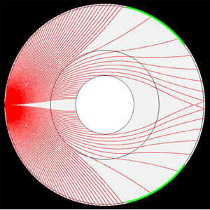

## History

The Hollow Earth Theory was proposed by Edmund Halley in 1692.
He made the claim that the Earth is a hollow shell some 500 miles
thick with two concentric shells and an innermost core with an inner sun.
He said that atmospheres separated these shells, that each shell had its own magnetic poles and all rotated at different
speeds.

## Hollow Planet Seismology vs Solid Earth Seismology

[by Jan Lamprecht](https://www.bibliotecapleyades.net/tierra_hueca/esp_tierra_hueca_9.htm)

Let me show you how my _**Hollow Planet**_ **_seismic model_** can explain the Earth's seismology better than the
existing solid Earth seismic model - and yet not one person at any university has shown the slightest interest in this.

The purpose of this page is to demonstrate a number of most amazing things about seismology to the Reader in the
clearest and simplest manner possible. When I wrote my book I did delve into the many deeper and more technical aspects
but I want to put that aside for now.

The purpose of this exercise is to show people visually a number of very important things which you will not find in any
book on earth. (Note: This material lends itself to a TV/documentary presentation and I have tried unsuccessfully for
the last 2 1/2 years to get someone to take some of my material and show it on TV because I believe it will blow
people's minds). The _**solid Earth model**_ is divided into three major segments (we will ignore the smaller ones as
they do not affect the bigger picture).

Those segments are (from the centre) :

* the Inner Core
* the Outer Core
* the Mantle

## Lesson #1: The Earth is NOT a ball of molten lava

The first question everyone asks me when they hear of the **_Hollow Planet_** idea is: "Where does lava come from then?"
The (completely FALSE) impression schools have created in everyone's minds is that the Earth is this red-hot ball of
lava. They then imagine that lava from volcanoes comes from the centre of the Earth.

Ask any geologist or seismologist if this is true and you will discover they disagree. Standard geology and seismology
texts tell a different story. Scientists know that _**most lava is slightly radioactive**_ and they believe it is
produced either by **_decaying radium_** (**_decayed uranium_**) or through stresses in the crust. Lava is created by
heat generated within the crust of the Earth. The crust is said to be no more than 20 miles thick, although to be honest
nobody has ever actually penetrated the crust so we really do not know what (if anything different) lies beneath it.
Scientists will tell you that lava is a crustal phenomenon and all _**lava comes**_ from no deeper than 20 miles down.

If the Earth were an "_ocean of molten lava_" then it would actually be subject to tidal pressures and the continents
would be broken to pieces as the earth rotated. Scientists say the **_Earth_** is actually composed of solid rock for
the most part. As you go deeper, the pressures are supposed to be so great that the rock actually flows from extreme
pressure. (As you will see, even this may not be really true). But **_nowhere_** in modern geology or seismology will
you see them saying the Earth is a ball of molten lava.

In fact, the final proof comes from _**seismology**_ itself. When an **_earthquake_** occurs, seismic waves travel out
in all directions throughout all the earth. There are two types of seismic waves: _**P**_ and **_S_**. Based on this,
scientists know that all of the earth is actually quite RIGID and composed only of rock. The only partial exception is
the **_Outer core_**. Take a look the seismic diagram below.

If the earth were truly molten, then seismic waves would be considerably dampened down. So the fact that seismic waves
can travel through and around the earth shows that it is mostly completely rigid and solid.

## Lesson #2: Traditional Hollow Earth ideas fail the "seismology test"

Let me show you why scientists simply laugh at the idea of a _**Hollow Planet**_. Keep in mind that all _Hollow
Earthers_ have, for more than a century, been saying that the Earth's crust is 800-1000 miles thick.

Note in the above diagram, that seismic waves travel from the source of an earthquake (on the left) through the Earth at
various angles and therefore reach the other side (this is not true of all seismic waves, but of the main ones, referred
to as "P" waves). If you were to propose that a planet only has a crust of 1,000 miles or less, then this is why a
scientist would laugh at you. See the image below.

## Lesson #3: Is there any Hollow Earth seismic model which allows waves to go around the Earth?

The obvious problem posed by the theory is that seismic waves actually reach right across to the other side of the **_
Earth_**. Scientists are therefore quite confident that the **_P waves_** must have passed through the core of the Earth
and this tells them that there cannot be a cavity.

When I did my feasibility study (which is what my [book](http://www.hiddenmysteries.com/redir/index25.html) is), I
looked at the problem from every conceivable angle to see if there was any **_Hollow Earth model_** which made seismic
sense. I found only one - I repeat - only one, which has any merits. All other _**Hollow Earth seismic models**_ are
failures. Take a look at it below.

What if density actually _DECREASES_ from a certain point onwards? You will notice all solid-earth seismology shows ray
paths curving in a "U" back to the surface of the **_Earth_**. That is because density and pressure increases as you go
deeper. But if, for some reason, density were to suddenly decrease, then the waves would curve in the opposite
direction! I realized this, and you can see what then happens. In the middle of the Mantle, where density suddenly
decreases, it causes seismic waves to travel around the cavity - **_right to the other side of the Earth!  
_**  
You would be excused for believing that the waves might have passed through the **_core of the Earth_** when in fact
nothing of the kind happened.

## Lesson #4: The Mystery of the "Shadow Zone"

The next problem in global seismology is explaining the mysterious "**_Shadow Zone_**". There is a lack of **_P waves_**
between 103o-144o from the epicenter of a quake. Take a look at the problem as seen from a university-level text-book on
seismology.

Note how the _**P waves**_ strike the _**Outer Core**_ and scientists believe the refraction caused by this sudden
change in density can explain **_the shadow_**. But notice, in this university-level text book how they are befuddled
because there are still some waves which reach the **_shadow zone_** (dotted line).

They are at a complete loss to explain this. Now let me explain to you how perfectly my **_Hollow Earth model_** solves
this problem. Take a look at the image below.

After changing some parameters in my **_Hollow Planet seismic model_**, I have a "**_Shadow Zone_**" which matches the
facts exactly! I made the cavity smaller, and I moved the "_point of maximum density_" (the dark circle in the Mantle)
somewhat lower. _Note_: The **_Green area_** near the surface is the "**_Shadow Zone_**". Now look at the amazing thing
that happens.

We have _**P waves**_ behaving as normal right up to 103o. Then suddenly there are very few of them inside the _**Shadow
Zone**_ and then after the _**Shadow Zone**_ we are a greater and greater number of ray paths eventually converging on
the other side of the **_Earth!_** This is exactly consistent with the known facts of global seismology!

Sometimes small things can make a huge difference. It is obvious from the **_Hollow Planet diagram_** why there would be
a _**Shadow Zone**_. This is caused by the gradual change from "_increasing density_" to "_decreasing density_." This
causes the waves to "split" - some to go down while others go up. So there has to then be an area on the surface which
receives less seismic waves than normal - hence the "**_Shadow Zone_**."

A really crucial point is that the "**_Shadow Zone_**" is not completely devoid of waves. In the **_Hollow Planet
model_** you can see why - it makes perfect sense. In the solid earth model you can see they have to stretch their
imaginations (dotted lines) in order to try to find some explanation. In their diagram they believe the Shadow is cased
by sharp refraction - but clearly that explanation does not quite fit the facts.

Lesson #5: Proving, that the Outer and Inner cores - do not exist at all

You have been wondering why I removed the **_Outer Core_** altogether from my **_Hollow Planet seismic model_**. The
answer is simple. There are two kinds of seismic waves - **_P waves_** - which are much **_like sound waves_**.

They are pressure waves caused by a direct "_push_" through the matter. But then there are **_S waves_** - **_shear
waves_** - which are like taking a piece of hose-pipe and moving it up and down rapidly. _**P waves**_ can travel
through everything except a vacuum (although if they traveled through air they would be considerably weaker than when
they traveled through rock or a liquid). **_S waves_** however, can only be transmitted _**through rigid materials**_ -
like rock.

It has long been known to scientists that unlike _**P waves**_ which can travel around the world - _**S waves**_ are in
fact "_blocked_" by something. They named this "_something_" the _**Outer Core**_. They decided the _**Outer Core**_ had
to be non-rigid. If the **_Outer Core_** were a type of "liquid" then _**P waves**_ could pass through it, but **_S
waves_** could not. Hence they "**_invented_**" the **_Outer Core_**. Very early on, when I became interested in the _**
Hollow Earth**_ idea, I realized this property of the **_Outer Core_**, and I wondered if the **_Outer Core_** was
really a liquid, or if it was, in reality a _**cavity**_. My big problem however was figuring out how **_P waves_**
behaved.

Now let me show you that the _**Outer Core**_ does not exist at all, while the **_Inner Core_** is merely the part of
the Earth in the immediate vicinity of the cavity!

The waves we are interested in are those which passed through the core - the **_PKP_** and _**PKIKP**_ **_waves_**. When
one takes a look at the data showing the speed with which seismic waves travel, one discovers an interesting thing:
Waves which _**pass through the Core**_ (those which are supposed to be going in a straight line) actually slow down!
What makes this even more curious is that _**P waves**_ are supposed to speed up when they pass through dense material.

And there is no place on this planet which is as dense as the **_Inner Core!_** So why do **_P waves_** then slow down?
According to the formula for the transmission of sound/pressure waves - speed is affected by two factors: (a) Density (
b) Elasticity. This gives scientists a way of getting out of the problem by saying: "If the Density has increased, but
the wave has slowed down, it must THEREFORE mean that the _Elasticity increased_."

Let us return to my **_Hollow Planet seismic model._**

Take a look at the ray paths of the waves which reached the **_other side of the Earth_**, beyond the **_Shadow Zones_**
. Look at the paths they traveled.

**(a)** They did not travel through the core - they took a longer path around the cavity/core

**(b)** They were the waves which traveled near the cavity - hence near the area of lowest density!

Both those factors would cause the waves to take a longer time to travel to the other side of the Earth, hence, giving
the appearance that they slowed down, while apparently traveling in a more-or-less straight line!! There, once more, we
find a perfect match between my _Hollow Planets Seismic model_ and what we know about global seismology.

As you can see, this explanation accounts for everything observed and yet there is no need for either an _Outer_ or _
Inner Core_.

## Lesson #6: Amazing Seismic Speed Revelations - proving the Earth is homogenous

_**Seismologists**_ often produce diagrams such as the one below which show the speed of seismic waves inside the _**
Earth**_ at various depths.

You will notice, at various depths, such as at the 5,000 Km level, the speed of waves **_changing very_** **_sharply_**

- either speeding up or slowing down. Scientists look at these sharp changes in speed and then state that this is due
  to _sharp changes in density_.

They use this to "_prove_" that the _Mantle_ is composed of a different type of material to the _Outer Core_ and so
forth. You have seen the _Hollow Planets seismic model_ and how radically a seismic ray's path may differ from the _
solid Earth model_. Supposing the Earth really is hollow, it would then follow that the paths of waves differ in reality
from what scientific theory supposes.

That being the case, scientists may suppose a certain ray speeds up or slows down when in fact it does nothing of the
kind. If they knew the right path (like the rays going through the core for example), then it might turn out that such
rapid speed changes never actually occur.

However, since scientists are obsessed with the need to have a model which matches the 6 trillion tons needed (according
to their _gravity experiments_), they need to find a way of "_packing lots of matter into the Earth_". So they are
looking for evidence of _changes in density_. I'm sure that when they find they have to account for certain behavior by
postulating such instantaneous increases/decreases in speed that it makes them confident they are on the right track.
But the opposite may be true. It is entirely possible that if one knew the exact paths of the rays that one would find
the speed of seismic waves would not vary that much.

This is a most important point. It would mean that my _Hollow Planet seismic model_ is internally consistent. In other
words, it postulates that the _Earth is homogenous_, and a resultant analysis of seismic wave speeds along the paths
postulated should then prove that indeed the Earth is homogenous.

This would be a further proof that my model is the right one and not the solid earth model.

## Lesson #7: Deep Quakes may disprove the Solid Earth model

According to scientists, pressure increases with depth. According to their calculations the pressure is so great that
between 70-150 Km down, all rock will begin to flow. Below 150 Km there is no known material which will not flow.

Therefore, _according to scientists_, there can be no earthquakes with epicenters deeper than 150 Km - because it is _
IMPOSSIBLE!  
_  
But there are! Tens of thousands of Earthquakes have epicenters **_deeper than 150 Km_**. The histogram below shows some
curious things.

It shows that earthquakes occur right up to a depth of 300 Km down.

The picture is somewhat consistent with science's expectations because there are less quakes with depth (though they do
not stop at 150 Km as expected). Then a most curious thing happens, they increase in number up to a depth of 700 Km
where they end. Scientists try to explain these quakes by invoking various possible strange properties of matter.
Although each theory advanced so far has had problems with it.

What no scientist on Earth is willing to accept is that maybe gravity does not behave the way they believe it does! That
histogram may be the proof that gravity does not behave as is expected at depth. Why can't scientists look at that
histogram and see it for what it might be telling us? That histogram may be "stating" quite clearly that the Earth does
not have those pressures inside and that it remains relatively cool down to incredible depths? Maybe that diagram is "
telling us" that gravity does not behave at depths the way we are expecting. If that is so, then everything we think we
know about the mass of the Earth may be wrong.

Note, gravity is a very weak force and even a bit of static electricity could produce an attraction far in excess of
anything gravity could produce - but with a fraction of the mass. If that is the case, you don't need to worry about the
Earth having to have a mass of 6 trillion tons. It may weigh considerably less.

As final note, it may be that there are quakes deeper than 700 Km but they are so far away, and maybe the effects of
gravity are so weak that they do not have enough force for us to detect them.

Let me point out that seismologists have indeed speculated about the possible existence of "Silent Earthquakes" which
are remain undetected by our equipment.

## Occam's Razor & the Hollow Planets model:

## When in doubt, the simplest model is probably right

There is "rule" in science known as _Occam's razor_. _Occam's Razor_ is a little piece of logic which states: When
choosing between two or more theories it is most likely that the simplest explanation is the correct one.

You have now seen my simple "sandwich" _Hollow Planet model_, which assumes the Earth is largely homogenous in
composition, and you have seen how this simple model can match and even better the achievements of the more complex and
unwieldy solid-Earth model. Does this idea of mine not satisfy _Occam's Razor_ much more than the solid-Earth theory
does?

I received an e-mail one day from someone studying at an American university. He said to me that he had never met such a
closed-minded group of people as the _Professors at Universities!_ Well, I would tend to agree with him. My book was
published in July 1999\. I sent copies to universities and I placed my book on the desks of university lecturers and
Professors. Not one of them spent so much as 10 minutes looking at my book. After leaving my book there for weeks I
eventually just gave up. Now I don't bother trying to win academics over.

My book is subtitled "_A Feasibility study of possible Hollow Worlds_" - and that is what it was. I wrote it because I
was certain I could actually contribute something, and I truly hoped some academics or scientists would take an honest
look at it. I thought if anyone would appreciate some original lateral thinking, it would be them! How wrong I was!
The _seismic diagram_ was the most important thing in it. I wanted scientists to compare my theoretical model against
theirs and to match the seismic data to it.

I was convinced it was superior to the complex solid earth model. It seemed to me to be a similar situation to the many
concentric orbits which were used to explain the orbits of planets until it was discovered that _orbits were really
elliptical_. Too bad there aren't any open-minded people in universities anywhere who would take a bit of their time to
take a look at my _Hollow Planets Seismic model_ and to compare its seismic predictions with those of their solid Earth
models.

I'll bet they would be very surprised by the results.

[Source](https://www.bibliotecapleyades.net/tierra_hueca/esp_tierra_hueca_9.htm)

